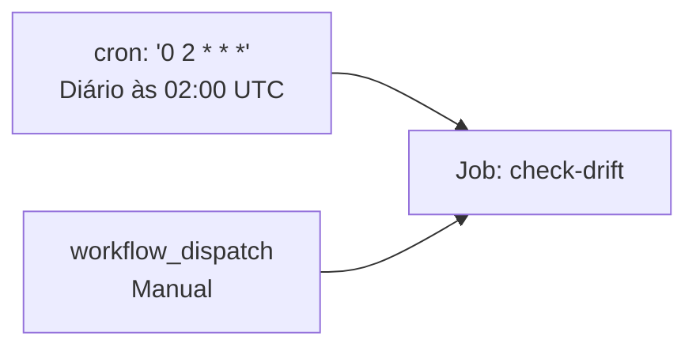
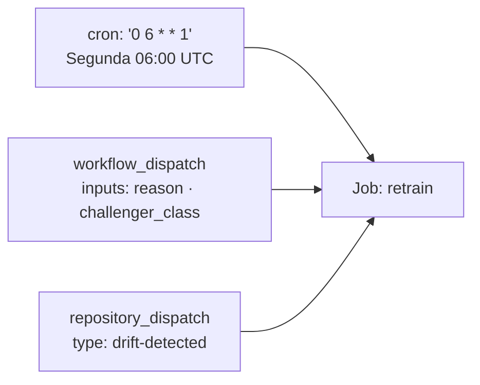
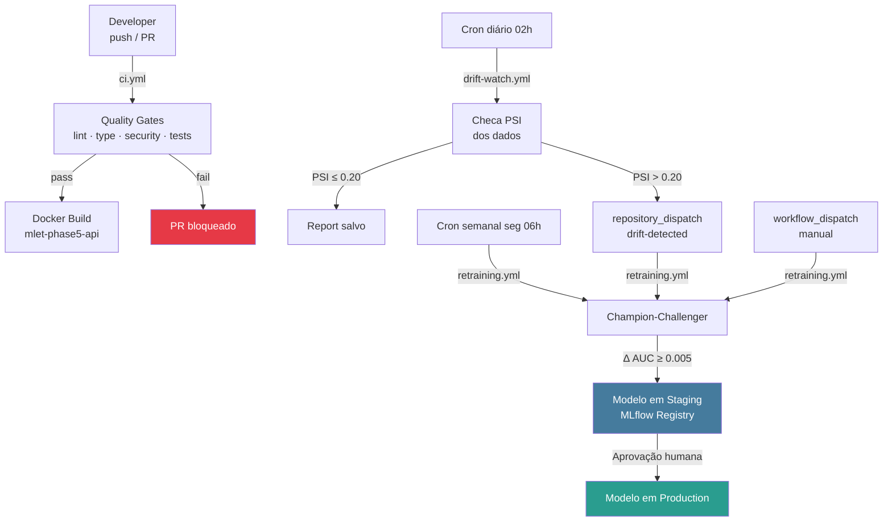
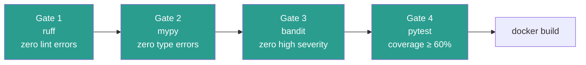

# .github/ — CI/CD e Automação

Workflows do GitHub Actions para integração contínua, monitoramento de drift e retraining automático. Implementa o **Nível 2 de Maturidade MLOps** em CI/CD.

---

## Sumário

1. [Visão Geral](#visão-geral)
2. [ci.yml — Pipeline Principal](#ciyml--pipeline-principal)
3. [drift-watch.yml — Monitoramento de Drift](#drift-watchyml--monitoramento-de-drift)
4. [retraining.yml — Champion-Challenger](#retrainingyml--champion-challenger)
5. [Fluxo Integrado](#fluxo-integrado)
6. [Quality Gates](#quality-gates)

---

## Visão Geral

```
.github/
└── workflows/
    ├── ci.yml            # lint → mypy → bandit → pytest → docker build
    ├── drift-watch.yml   # cron diário: PSI check → trigger retraining
    └── retraining.yml    # champion-challenger (3 triggers)
```

---

## `ci.yml` — Pipeline Principal

Executado em cada push/PR que afeta código-fonte.

### Triggers

| Evento | Paths |
|--------|-------|
| `push` | `src/**`, `tests/**`, `evaluation/**`, `scripts/**`, `pyproject.toml`, `Makefile`, `.github/workflows/**` |
| `pull_request` | Idem |
| `workflow_dispatch` | Manual (com campo `reason`) |

### Jobs

```mermaid
flowchart TD
    subgraph quality["Job: quality (ubuntu-latest)"]
        C[checkout@v4] --> PY[setup-python@v5<br/>Python 3.11 · cache pip]
        PY --> INST[pip install -e .[dev]]
        INST --> LINT[ruff check src/ tests/ evaluation/ scripts/]
        LINT --> TYPE[mypy src/ --ignore-missing-imports]
        TYPE --> SEC[bandit -r src/ -c pyproject.toml]
        SEC --> TEST[pytest tests/ -x<br/>--cov=src<br/>--cov-fail-under=60<br/>--junitxml=test-results.xml]
        TEST --> ART[upload-artifact@v4<br/>coverage.xml + test-results.xml]
    end

    subgraph build["Job: build (needs: quality)"]
        ART --> DOCK[docker build -t mlet-phase5-api<br/>-f src/serving/Dockerfile .]
    end

    style quality fill:#0d3349,stroke:#4a9eff,color:#fff
    style build fill:#0d3349,stroke:#4a9eff,color:#fff
```

### Detalhes dos Steps

| Step | Comando | Objetivo |
|------|---------|----------|
| **Lint** | `ruff check src/ tests/ evaluation/ scripts/` | Estilo + imports + anti-patterns |
| **Type check** | `mypy src/ --ignore-missing-imports` | Verificação de tipos estática |
| **Security scan** | `bandit -r src/ -c pyproject.toml` | SAST — OWASP vulnerabilidades |
| **Unit tests** | `pytest tests/ -x --cov-fail-under=60` | Funcionalidade + cobertura mínima 60% |
| **Docker build** | `docker build -f src/serving/Dockerfile .` | Verifica buildabilidade da imagem |

### Artefatos Publicados

| Artefato | Arquivo | Descrição |
|----------|---------|-----------|
| `test-results` | `test-results.xml` | Resultados JUnit para GitHub UI |
| `test-results` | `coverage.xml` | Cobertura para tools externas |

---

## `drift-watch.yml` — Monitoramento de Drift

Monitora drift diariamente e aciona retraining quando PSI crítico é detectado.

### Triggers



### Job: `check-drift`

```mermaid
flowchart TD
    CO[checkout@v4] --> PY2[setup-python 3.11]
    PY2 --> INST2[pip install -e .[monitor]]
    INST2 --> DVC2[dvc repro prepare<br/>dados de referência]
    DVC2 --> DRIFT2[python scripts/run_drift_check.py]

    DRIFT2 --> CHK{drift_status == critical?}
    CHK -->|Não| LOG[Salva report<br/>upload-artifact]
    CHK -->|Sim| DISP[github.rest.actions.createWorkflowDispatch<br/>retraining.yml<br/>event_type: drift-detected]
    DISP --> LOG
    LOG --> END2([Fim])

    style CHK fill:#e63946,color:#fff
    style DISP fill:#e9c46a
```

### Saída

- Artefato `drift-report` com HTML + JSON de cada execução
- `repository_dispatch` para `retraining.yml` quando PSI > 0.20

---

## `retraining.yml` — Champion-Challenger

Pipeline de retraining com 3 triggers e decisão automática baseada em Δ AUC.

### Triggers



### Job: `retrain`

```mermaid
flowchart TD
    CO2[checkout@v4] --> PY3[setup-python 3.11]
    PY3 --> INST3[pip install -e .[dev,monitor]]
    INST3 --> DVC3[dvc repro<br/>prepare + train]
    DVC3 --> CHAMP2[Carrega champion<br/>do MLflow Registry]
    CHAMP2 --> TRAIN3[Treina challenger]
    TRAIN3 --> REG3[register_model_to_registry<br/>GAP 05 tags]
    REG3 --> COMP3[Compara AUC<br/>champion vs challenger]

    COMP3 --> DELTA3{Δ AUC ≥ 0.005?}
    DELTA3 -->|Sim| PROM3[Promove challenger<br/>para Staging]
    DELTA3 -->|Não| REJ3[Rejeita challenger<br/>Log da comparação]

    PROM3 --> HUMAN3[Human-in-the-loop<br/>Staging → Production<br/>via MLflow UI]
    REJ3 & HUMAN3 --> ART3[upload-artifact<br/>retraining-results]

    style DELTA3 fill:#e63946,color:#fff
    style PROM3 fill:#2a9d8f,color:#fff
    style HUMAN3 fill:#457b9d,color:#fff
```

### Inputs do `workflow_dispatch`

| Input | Padrão | Descrição |
|-------|--------|-----------|
| `reason` | `"scheduled retraining"` | Motivo (audit trail no MLflow) |
| `challenger_class` | `"LogisticRegressionBaseline"` | Modelo challenger |

---

## Fluxo Integrado



---

## Quality Gates

O job `quality` implementa **4 gates obrigatórios** — todos devem passar para o job `build` executar:



### Configurações dos Gates

| Gate | Ferramenta | Config | Critério de falha |
|------|-----------|--------|-------------------|
| Lint | `ruff` | `pyproject.toml [tool.ruff]` | Qualquer erro E/F/I/N/W/UP |
| Type | `mypy` | `pyproject.toml [tool.mypy]` | Qualquer erro de tipo |
| Security | `bandit` | `pyproject.toml [tool.bandit]` | Qualquer HIGH severity |
| Tests | `pytest` | `pyproject.toml [tool.pytest]` | Cobertura < 60% ou teste falhando |

### Sobre os `bandit` skips

Os skips `B404/B603/B607` em `pyproject.toml` são **justificados**:
- Usados apenas em `src/models/train.py::_git_sha()` para capturar o SHA do commit
- Args 100% hard-coded: `["git", "rev-parse", "--short", "HEAD"]`
- Sem `shell=True`, sem entrada de usuário
- Necessário para o campo `git_sha` do GAP 05
