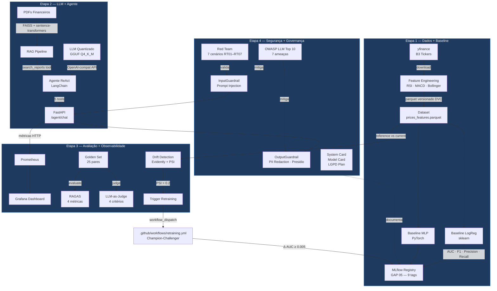
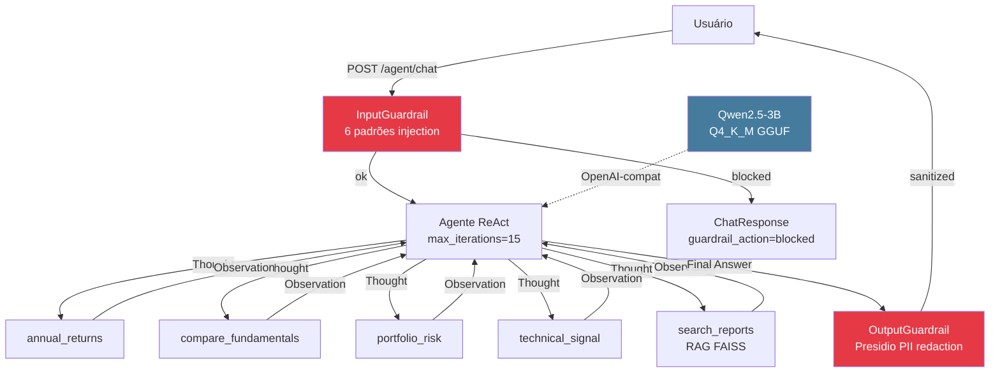
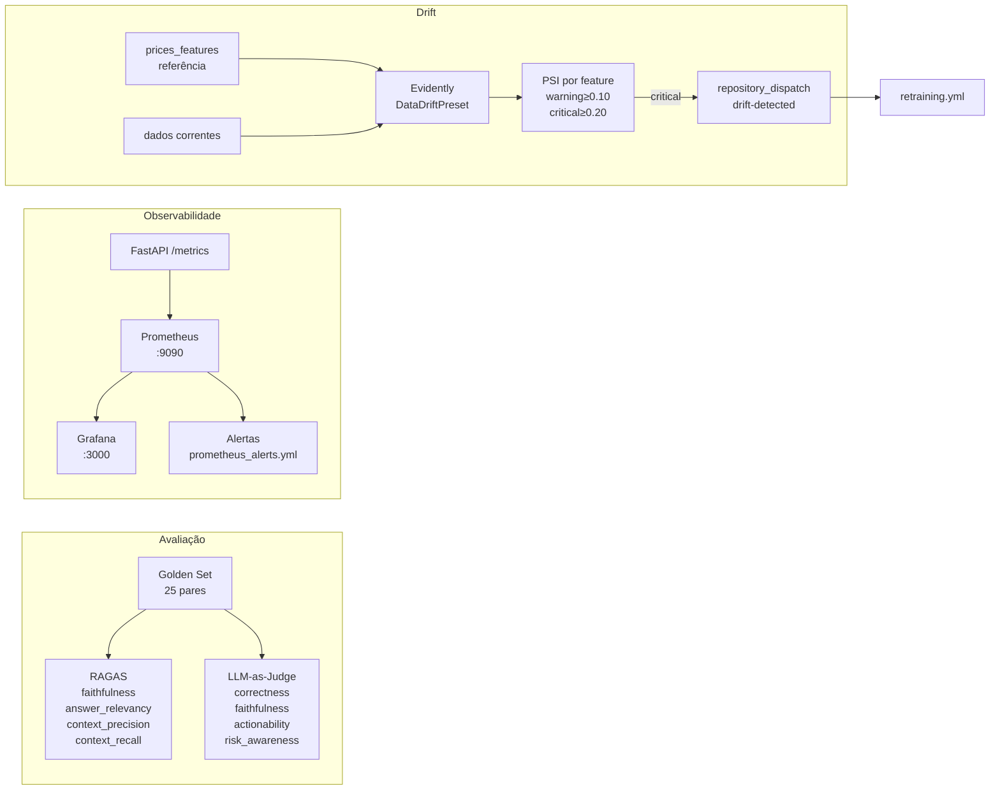
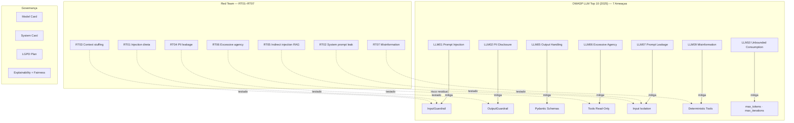
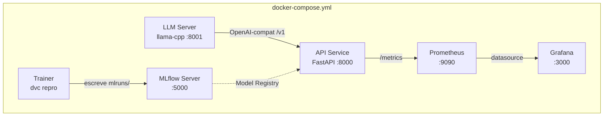
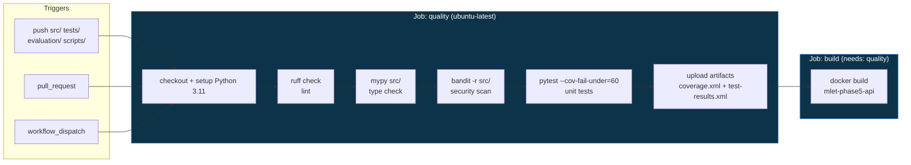
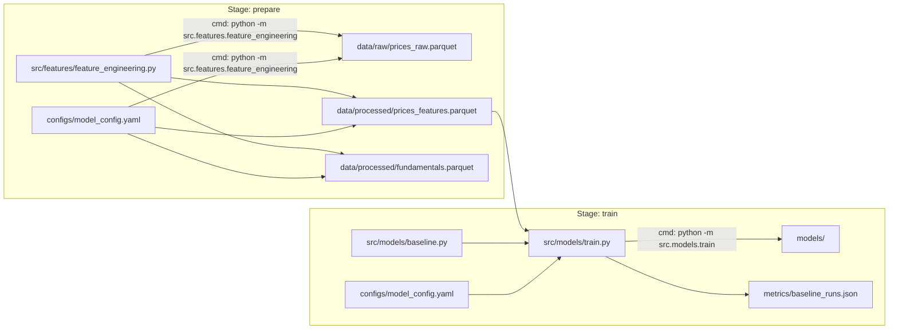
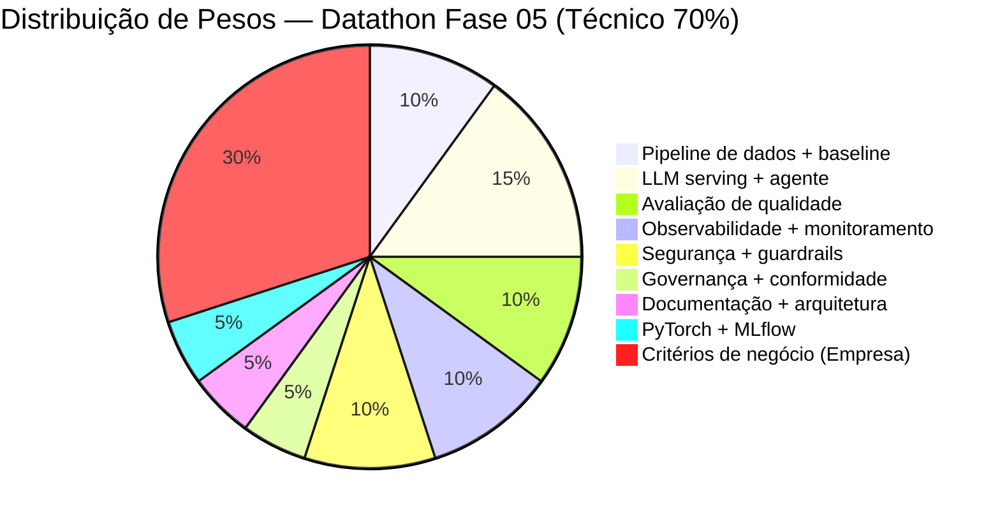

# MLET-Phase-5 — Datathon Fase 5: LLMs e Agentes

Agente conversacional financeiro de produção sobre o universo **PETR4, VALE3, ITUB4, BBDC4 e WEGE3 (B3)**.
Projeto integrador que cobre as **Fases 01–05** do MLET Pós-Tech com maturidade MLOps Nível 2.

---

## Sumário

1. [Visão Geral](#visão-geral)
2. [Arquitetura do Sistema](#arquitetura-do-sistema)
3. [Estrutura do Repositório](#estrutura-do-repositório)
4. [As 4 Etapas](#as-4-etapas)
5. [Quick Start](#quick-start)
6. [Serviços e Infraestrutura](#serviços-e-infraestrutura)
7. [Pipeline CI/CD](#pipeline-cicd)
8. [Pipeline de Dados (DVC)](#pipeline-de-dados-dvc)
9. [Maturidade MLOps — Nível 2](#maturidade-mlops--nível-2)
10. [Tools do Agente](#tools-do-agente)
11. [Checklist de Entrega](#checklist-de-entrega)
12. [Distribuição de Pesos na Avaliação](#distribuição-de-pesos-na-avaliação)

---

## Visão Geral

| Dimensão | Detalhe |
|----------|---------|
| **Domínio** | Mercado financeiro — ações B3 (PETR4, VALE3, ITUB4, BBDC4, WEGE3) |
| **Tipo** | Agente ReAct com RAG + LLM quantizado + guardrails de segurança |
| **LLM** | Qwen2.5-3B-Instruct Q4\_K\_M (GGUF via `llama-cpp-python`) |
| **Frameworks** | FastAPI · LangChain · FAISS · MLflow · Evidently · Prometheus · Grafana |
| **Maturidade** | Microsoft MLOps Maturity Model — **Nível 2** em 6 dimensões |
| **Cobertura CI** | ≥ 60% (`--cov-fail-under=60`) |
| **Golden Set** | 25 pares pergunta/resposta |
| **OWASP LLM** | 7 ameaças mapeadas e mitigadas |

---

## Arquitetura do Sistema



---

## Estrutura do Repositório

```
MLET-Phase-5/
├── .github/
│   └── workflows/
│       ├── ci.yml                   # lint → mypy → bandit → pytest → docker build
│       ├── drift-watch.yml          # cron diário: PSI → trigger retraining
│       └── retraining.yml           # champion-challenger (Δ AUC ≥ 0.005)
├── configs/
│   ├── model_config.yaml            # hiperparâmetros + tickers + MLflow
│   ├── llm_config.yaml              # GGUF path, n_ctx, n_threads
│   ├── monitoring_config.yaml       # PSI thresholds (0.10 warning, 0.20 critical)
│   ├── prometheus.yml               # scrape config
│   ├── prometheus_alerts.yml        # alertas de degradação
│   └── grafana/                     # datasource + dashboard provisionados
├── data/
│   ├── raw/                         # prices_raw.parquet (NÃO commitar — DVC)
│   ├── processed/                   # prices_features.parquet · fundamentals.parquet
│   └── golden_set/
│       └── golden_set.json          # 25 pares (query, expected_answer, contexts)
├── docs/
│   ├── MODEL_CARD.md                # Model Card (Mitchell et al. 2019)
│   ├── SYSTEM_CARD.md               # System Card ponta-a-ponta
│   ├── LGPD_PLAN.md                 # Conformidade LGPD aplicada ao caso real
│   ├── OWASP_MAPPING.md             # 7 ameaças OWASP LLM Top 10 (2025)
│   ├── RED_TEAM_REPORT.md           # 7 cenários adversariais RT01–RT07
│   ├── BENCHMARK.md                 # Benchmark ≥ 3 configurações
│   ├── BUSINESS_METRICS.md          # Métricas técnicas × negócio
│   ├── MONITORING.md                # Guia de observabilidade
│   ├── RETRAINING.md                # Estratégia champion-challenger
│   ├── EXPLAINABILITY_FAIRNESS.md   # Explicabilidade + fairness por ticker
│   └── PITCH.md                     # Roteiro Demo Day ≤ 10 min
├── evaluation/
│   ├── ragas_eval.py                # RAGAS: 4 métricas obrigatórias
│   ├── llm_judge.py                 # LLM-as-judge: 4 critérios
│   └── ab_test_prompts.py           # A/B test de prompts ReAct
├── notebooks/
│   └── 01_eda.ipynb                 # EDA exploratória (B3 tickers)
├── scripts/
│   ├── build_rag_index.py           # Indexa PDFs → FAISS
│   ├── run_benchmark.py             # Benchmark ≥ 3 configs
│   ├── run_evaluation.py            # Roda RAGAS + LLM-judge
│   ├── run_drift_check.py           # Checa drift e salva report
│   ├── run_red_team.py              # 7 cenários adversariais
│   └── run_retraining.py            # Pipeline champion-challenger
├── src/
│   ├── features/
│   │   └── feature_engineering.py  # RSI, MACD, Bollinger, retornos
│   ├── models/
│   │   ├── baseline.py             # LogisticRegressionBaseline + MLPClassifierTorch
│   │   └── train.py                # train_and_log + register_model_to_registry
│   ├── agent/
│   │   ├── react_agent.py          # create_datathon_agent (ReAct)
│   │   ├── tools.py                # 5 tools financeiras
│   │   └── rag_pipeline.py         # FAISS retriever
│   ├── serving/
│   │   ├── app.py                  # FastAPI: /health /metrics /llm/complete /agent/chat
│   │   └── Dockerfile              # multi-stage (builder → runtime)
│   ├── monitoring/
│   │   ├── drift.py                # Evidently + PSI
│   │   └── metrics.py              # Prometheus counters/histograms/gauges
│   └── security/
│       ├── guardrails.py           # InputGuardrail + OutputGuardrail
│       └── pii_detection.py        # PIIDetector (Presidio + regex CPF/CNPJ)
├── tests/
│   ├── conftest.py                 # fixtures: sample_ohlcv, sample_features
│   ├── test_features.py            # schema Pandera + nulls + row count
│   ├── test_models.py              # LogReg + MLP predict shape/range
│   ├── test_agent.py               # tools + RAG + chunk_text
│   ├── test_api.py                 # FastAPI TestClient
│   ├── test_guardrails.py          # RT01–RT05 + PII redaction
│   ├── test_evaluation.py          # RAGAS mock + judge structure
│   └── test_monitoring.py          # PSI cálculo + thresholds
├── docker-compose.yml              # mlflow · trainer · llm-server · api · prometheus · grafana
├── dvc.yaml                        # pipeline: prepare → train
├── pyproject.toml                  # hatchling · ruff · mypy · pytest · bandit
├── Makefile                        # data · train · test · serve · eval · drift · red-team
├── Dockerfile                      # imagem raiz alternativa
└── .env.example                    # template de variáveis de ambiente
```

---

## As 4 Etapas

### Etapa 1 — Dados + Baseline (Fases 01–02)

```mermaid
flowchart LR
    A[yfinance<br/>5 anos · 1d] -->|download_prices| B[prices_raw.parquet]
    B -->|compute_features| C[RSI-14<br/>MACD diff<br/>%B Bollinger<br/>Retorno 1d]
    C --> D[prices_features.parquet]
    D -->|train_and_log| E[LogReg<br/>sklearn]
    D -->|train_and_log| F[MLP<br/>PyTorch]
    E -->|register_model_to_registry| G[MLflow Registry<br/>9 tags GAP-05]
    F --> G
    G --> H[metrics/baseline_runs.json]

    style A fill:#264653
    style G fill:#2a9d8f
```



**Artefatos produzidos:**
- `data/raw/prices_raw.parquet` — série temporal bruta OHLCV
- `data/processed/prices_features.parquet` — 15+ features técnicas
- `data/processed/fundamentals.parquet` — P/L, ROE, Dividend Yield
- `metrics/baseline_runs.json` — AUC, F1, Precision, Recall de cada run
- `mlruns/` — experimentos MLflow com parâmetros, métricas e artefatos

**Reprodução:**
```bash
make data    # dvc repro prepare
make train   # dvc repro train
```

---

### Etapa 2 — LLM + Agente (Fases 03–05)



**Reprodução:**
```bash
export LLM_MODEL_PATH="models/qwen2.5-3b-instruct-q4_k_m.gguf"
make rag-index   # opcional — indexa PDFs em data/raw/reports/
make serve       # uvicorn src.serving.app:app --port 8000
```

---

### Etapa 3 — Avaliação + Observabilidade (Fases 03–05)



**Reprodução:**
```bash
make docker-up   # sobe Prometheus + Grafana
make eval        # RAGAS + LLM-judge → metrics/evaluation.json
make drift       # Evidently → data/processed/drift_reports/
```

**Endpoints de observabilidade:**
| URL | Descrição |
|-----|-----------|
| `http://localhost:8000/docs` | Swagger UI |
| `http://localhost:8000/metrics` | Prometheus exposition |
| `http://localhost:9090` | Prometheus |
| `http://localhost:3000` | Grafana (`admin/admin`) |

---

### Etapa 4 — Segurança + Governança (Fases 04–05)



**Reprodução:**
```bash
make docker-up
make red-team    # 7 cenários → metrics/red_team.json
pytest tests/test_guardrails.py -v
```

---

## Quick Start

### Pré-requisitos

- Python 3.11+
- [uv](https://github.com/astral-sh/uv)
- Docker + Docker Compose
- Git

### Setup Local

```bash
# 1. Clone e entre no diretório
git clone <repo-url> && cd MLET-Phase-5

# 2. Crie o virtual environment
uv venv .venv
source .venv/bin/activate          # Linux/macOS
# .venv\Scripts\activate           # Windows PowerShell

# 3. Instale todas as dependências
uv pip install -e ".[dev,serve,eval,monitor,security]"

# 4. Baixe o modelo de linguagem PT para o Presidio
python -m spacy download pt_core_news_sm

# 5. Configure as variáveis de ambiente
cp .env.example .env
# Edite .env com os valores do seu ambiente

# 6. Instale os hooks de qualidade
pre-commit install
```

### Variáveis de Ambiente

| Variável | Descrição | Exemplo |
|----------|-----------|---------|
| `LLM_MODEL_PATH` | Caminho para o arquivo GGUF | `models/qwen2.5-3b-instruct-q4_k_m.gguf` |
| `MLFLOW_TRACKING_URI` | URI do MLflow server | `http://localhost:5000` |
| `OPENAI_API_KEY` | Chave para LLM externo (opcional) | `sk-...` |
| `OPENAI_API_BASE` | Base URL para LLM local | `http://localhost:8000/v1` |
| `TEAM_OWNER` | Identificador da equipe | `grupo-XX` |

### Fluxo Completo de Reprodução

```bash
# Etapa 1 — Dados + Baseline
make data        # baixa yfinance → features parquet via DVC
make train       # treina LogReg + MLP → MLflow Registry
make test        # pytest --cov-fail-under=60

# Etapa 2 — LLM + Agente
make rag-index   # indexa PDFs em data/raw/reports/ → FAISS
make serve       # FastAPI na porta 8000

# Etapa 3 — Avaliação + Observabilidade
make docker-up   # sobe toda a stack (MLflow + API + Prometheus + Grafana)
make eval        # RAGAS + LLM-judge
make drift       # Evidently drift report

# Etapa 4 — Segurança
make red-team    # 7 cenários adversariais
```

---

## Serviços e Infraestrutura



| Serviço | Porta | Descrição |
|---------|-------|-----------|
| MLflow Server | 5000 | Experiment tracking + Model Registry |
| LLM Server | 8001 | Qwen2.5-3B GGUF via llama-cpp-python |
| API (FastAPI) | 8000 | Endpoints do agente + métricas |
| Prometheus | 9090 | Coleta de métricas operacionais |
| Grafana | 3000 | Dashboard "Datathon Fase 5 — Agente Financeiro" |

---

## Pipeline CI/CD



### Workflows Adicionais

| Workflow | Trigger | Ação |
|----------|---------|------|
| `drift-watch.yml` | cron diário `0 2 * * *` | Checa PSI; emite `repository_dispatch` se PSI > 0.2 |
| `retraining.yml` | cron semanal segunda 06h + drift-event + manual | Champion-challenger; promove se Δ AUC ≥ 0.005 |

---

## Pipeline de Dados (DVC)



**Comandos DVC:**
```bash
dvc repro           # executa toda a pipeline
dvc repro prepare   # apenas stage de dados
dvc repro train     # apenas stage de treino
dvc status          # verifica quais stages precisam re-executar
```

---

## Maturidade MLOps — Nível 2

| Dimensão | Nível 0 ❌ | Nível 1 ⚠️ | **Nível 2 ✅** | Implementação |
|----------|-----------|------------|---------------|---------------|
| Experiment Management | Sem tracking | MLflow manual | MLflow padronizado + metrics + artifacts | `src/models/train.py::train_and_log` |
| Model Management | Sem registro | Registro manual | Model Registry + versionamento + 9 tags | `src/models/train.py::register_model_to_registry` |
| CI/CD | Sem pipeline | Pipeline manual | GitHub Actions lint→test→build→deploy | `.github/workflows/ci.yml` |
| Monitoring | Sem observabilidade | Logs básicos | Métricas + drift detection + dashboard + alertas | `src/monitoring/` + Grafana |
| Data Management | Dados soltos | Cópia manual | DVC + dados sintéticos para testes | `dvc.yaml` + `tests/conftest.py` |
| Feature Management | Sem feature store | Single-model | Features compartilhadas + validação Pandera | `src/features/` + `tests/test_features.py` |

### Cobertura dos 9 GAPs Críticos

| GAP | Anti-padrão | Solução Implementada |
|-----|-------------|---------------------|
| GAP 01 | Zero monitoring | Prometheus + Grafana + alertas por degradação |
| GAP 02 | Notebook como SPOF | Pipeline isolado: DVC stages + CI/CD |
| GAP 03 | Feature store full-flush | Upsert incremental — sem janela de store vazio |
| GAP 04 | Cobertura ~0% | `--cov-fail-under=60` + `[tool.coverage]` |
| GAP 05 | Tags MLflow inconsistentes | 9 campos obrigatórios + Model Registry |
| GAP 06 | Sem detecção de drift | Evidently + PSI (0.10 warning / 0.20 critical) |
| GAP 07 | Retraining ad-hoc | Champion-challenger + 3 triggers + Δ AUC ≥ 0.005 |
| GAP 08 | Ambiente dev sem dados | DVC + fixtures sintéticos + `.env.example` |
| GAP 09 | Skills gap eng. software | Type hints + docstrings + logging + pyproject.toml |

---

## Tools do Agente

| Tool | Tipo | Pergunta-alvo |
|------|------|---------------|
| `annual_returns` | Quantitativa | "Qual ação teve maior retorno em 2024?" |
| `compare_fundamentals` | Quantitativa | "Compare PETR4 e VALE3 pelo P/L e ROE." |
| `portfolio_risk` | Quantitativa | "Qual o VaR 95% de uma carteira PETR4 40%/VALE3 30%/WEGE3 30%?" |
| `technical_signal` | Quantitativa | "Qual o sinal técnico atual de ITUB4?" |
| `search_reports` | Qualitativa (RAG) | "O que o relatório da PETR4 diz sobre capex?" |

---

## Checklist de Entrega

### Etapa 1 — Dados + Baseline
- ✅ EDA documentada com insights relevantes — [notebooks/01_eda.ipynb](notebooks/01_eda.ipynb)
- ✅ Baseline treinado com métricas no MLflow — [src/models/train.py](src/models/train.py)
- ✅ Pipeline versionado DVC + Docker reprodutível — [dvc.yaml](dvc.yaml)
- ✅ Métricas de negócio mapeadas para técnicas — [docs/BUSINESS_METRICS.md](docs/BUSINESS_METRICS.md)
- ✅ `pyproject.toml` com todas as dependências — [pyproject.toml](pyproject.toml)

### Etapa 2 — LLM + Agente
- ✅ LLM servido via API com quantização (GGUF Q4\_K\_M) — [src/serving/app.py](src/serving/app.py)
- ✅ Agente ReAct com 5 tools (≥ 3 exigidas) — [src/agent/tools.py](src/agent/tools.py)
- ✅ RAG retornando contexto relevante dos dados — [src/agent/rag_pipeline.py](src/agent/rag_pipeline.py)
- ✅ CI/CD funcional (GitHub Actions lint→test→build) — [.github/workflows/ci.yml](.github/workflows/ci.yml)
- ✅ Benchmark ≥ 3 configurações — [docs/BENCHMARK.md](docs/BENCHMARK.md)

### Etapa 3 — Avaliação + Observabilidade
- ✅ Golden set com 25 pares (≥ 20) — [data/golden_set/golden_set.json](data/golden_set/golden_set.json)
- ✅ RAGAS: 4 métricas calculadas e reportadas — [evaluation/ragas_eval.py](evaluation/ragas_eval.py)
- ✅ LLM-as-judge com 4 critérios (2 de negócio) — [evaluation/llm_judge.py](evaluation/llm_judge.py)
- ✅ Telemetria e dashboard end-to-end — [src/monitoring/metrics.py](src/monitoring/metrics.py)
- ✅ Drift detection implementada e documentada — [src/monitoring/drift.py](src/monitoring/drift.py)

### Etapa 4 — Segurança + Governança
- ✅ OWASP mapping com 7 ameaças e mitigações — [docs/OWASP_MAPPING.md](docs/OWASP_MAPPING.md)
- ✅ Guardrails de input e output funcionais — [src/security/guardrails.py](src/security/guardrails.py)
- ✅ 7 cenários adversariais testados e documentados — [docs/RED_TEAM_REPORT.md](docs/RED_TEAM_REPORT.md)
- ✅ Plano LGPD aplicado ao caso real — [docs/LGPD_PLAN.md](docs/LGPD_PLAN.md)
- ✅ Explicabilidade e fairness documentados — [docs/EXPLAINABILITY_FAIRNESS.md](docs/EXPLAINABILITY_FAIRNESS.md)
- ✅ System Card completo — [docs/SYSTEM_CARD.md](docs/SYSTEM_CARD.md)

---

## Distribuição de Pesos na Avaliação



---

## Referências

- Yao, S. et al. **ReAct: Synergizing Reasoning and Acting in Language Models**. ICLR, 2023.
- Es, S. et al. **RAGAS: Automated Evaluation of Retrieval Augmented Generation**. 2024.
- Mitchell, M. et al. **Model Cards for Model Reporting**. FAT\*, 2019.
- OWASP. **Top 10 for Large Language Model Applications (2025)**.
- Microsoft. **MLOps Maturity Model**, 2026.
- BRASIL. **Lei nº 13.709/2018 — LGPD**.

---

> Documentação completa de cada módulo disponível nos READMEs das subpastas:
> [`src/`](src/README.md) · [`evaluation/`](evaluation/README.md) · [`tests/`](tests/README.md) · [`data/`](data/README.md) · [`docs/`](docs/README.md) · [`scripts/`](scripts/README.md) · [`configs/`](configs/README.md)
