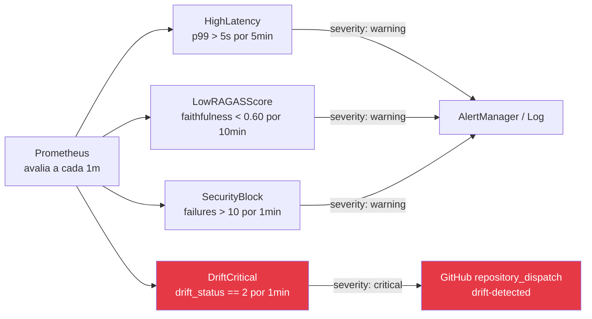
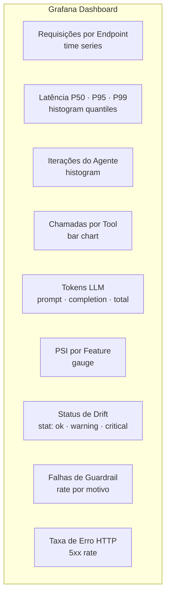
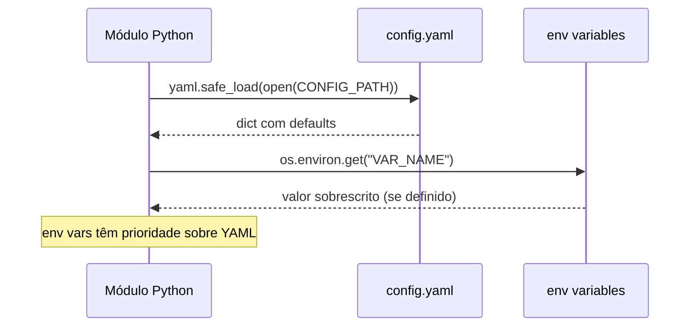

# configs/ — Configurações do Sistema

Arquivos de configuração YAML para todos os componentes do sistema: modelo, LLM, monitoramento, Prometheus e Grafana.

---

## Sumário

1. [Visão Geral](#visão-geral)
2. [model_config.yaml](#model_configyaml)
3. [llm_config.yaml](#llm_configyaml)
4. [monitoring_config.yaml](#monitoring_configyaml)
5. [prometheus.yml](#prometheusyml)
6. [prometheus_alerts.yml](#prometheus_alertsyml)
7. [grafana/](#grafana)
8. [Como os Configs são Carregados](#como-os-configs-são-carregados)

---

## Visão Geral

```
configs/
├── model_config.yaml          # Etapa 1 — tickers, hiperparâmetros, MLflow
├── llm_config.yaml            # Etapa 2 — GGUF path, n_ctx, n_threads
├── monitoring_config.yaml     # Etapa 3 — PSI thresholds, alertas
├── prometheus.yml             # Etapa 3 — scrape config
├── prometheus_alerts.yml      # Etapa 3 — regras de alerta
└── grafana/
    ├── provisioning/
    │   ├── datasources/
    │   │   └── prometheus.yml # Datasource automático
    │   └── dashboards/
    │       └── dashboards.yml # Loader automático
    └── dashboards/
        └── agent_dashboard.json  # Dashboard "Datathon Fase 5"
```

---

## `model_config.yaml`

Configurações para feature engineering, treinamento de modelos e MLflow.

```yaml
tickers:
  - PETR4.SA
  - VALE3.SA
  - ITUB4.SA
  - BBDC4.SA
  - WEGE3.SA

training:
  test_size: 0.2
  random_state: 42
  risk_level: medium         # low | medium | high | critical
  fairness_checked: false

model:
  hyperparameters:
    C: 1.0
    max_iter: 1000
    solver: lbfgs

mlp:
  hidden_dim: 128
  dropout: 0.3
  learning_rate: 0.001
  epochs: 50

mlflow:
  experiment_name: mlet-phase5
  tracking_uri: file:./mlruns  # ou http://localhost:5000
```

**Consumido por:**
- `src/features/feature_engineering.py` → tickers
- `src/models/train.py` → training + model + mlp + mlflow

---

## `llm_config.yaml`

Configurações para o LLM quantizado e o agente ReAct.

```yaml
llm:
  model_path: ""            # Sobrescrito por LLM_MODEL_PATH env var
  n_ctx: 4096              # Janela de contexto em tokens
  n_threads: 4             # Threads CPU para inferência
  n_gpu_layers: 0          # 0 = CPU only; -1 = todas as camadas na GPU

agent:
  model_name: qwen2.5-3b-instruct  # Nome para o AgentExecutor
  temperature: 0.0                  # Greedy decoding
  max_tokens: 512                   # Tokens máximos por geração
```

**Consumido por:**
- `src/serving/app.py` → `get_llm()` e `get_agent()`

**Sobrescrita via environment:**

| Variável | Sobrescreve |
|----------|-------------|
| `LLM_MODEL_PATH` | `llm.model_path` |
| `OPENAI_API_BASE` | URL base para LLM externo |
| `OPENAI_API_KEY` | Chave API |

---

## `monitoring_config.yaml`

Thresholds para detecção de drift e alertas operacionais.

```yaml
alerts:
  psi_warning: 0.10    # PSI ≥ 0.10 → status: warning
  psi_critical: 0.20   # PSI ≥ 0.20 → status: critical + trigger retraining
  latency_p99_ms: 5000 # Latência P99 > 5s → alerta
  min_faithfulness: 0.60  # RAGAS faithfulness < 0.60 → alerta

drift:
  reference_days: 365    # Janela de referência (dados de treino)
  current_days: 30       # Janela corrente para comparação
  check_interval_hours: 24  # Frequência do check automático
```

**Consumido por:**
- `src/monitoring/drift.py` → `_load_thresholds()`
- `scripts/run_drift_check.py`

---

## `prometheus.yml`

Configuração de scrape para coleta de métricas.

```yaml
global:
  scrape_interval: 15s
  evaluation_interval: 15s

rule_files:
  - /etc/prometheus/prometheus_alerts.yml

scrape_configs:
  - job_name: 'datathon-api'
    static_configs:
      - targets: ['api:8000']  # FastAPI /metrics
    metrics_path: /metrics

  - job_name: 'prometheus'
    static_configs:
      - targets: ['localhost:9090']
```

---

## `prometheus_alerts.yml`

Regras de alerta para degradação de performance.



**Alertas configurados:**

| Alerta | Expressão | For | Severidade |
|--------|-----------|-----|------------|
| `HighLatency` | `histogram_quantile(0.99, ...) > 5` | 5m | warning |
| `DriftCritical` | `drift_status == 2` | 1m | critical |
| `LowRAGASScore` | `ragas_faithfulness_score < 0.6` | 10m | warning |
| `SecurityBlock` | `rate(agent_question_failures_total[1m]) > 10` | 1m | warning |
| `HighErrorRate` | `rate(http_requests_total{status="500"}[5m]) > 0.05` | 5m | warning |

---

## `grafana/`

### Provisioning automático

O Grafana é configurado automaticamente via `provisioning/`:

```
grafana/
├── provisioning/
│   ├── datasources/
│   │   └── prometheus.yml    # Conecta ao Prometheus :9090
│   └── dashboards/
│       └── dashboards.yml    # Carrega dashboards de /dashboards/
└── dashboards/
    └── agent_dashboard.json  # Dashboard principal
```

**Credentials padrão:** `admin / admin` (alterar em produção)

### Dashboard `agent_dashboard.json`

Dashboard **"Datathon Fase 5 — Agente Financeiro"** com os seguintes painéis:



**Acesso:** `http://localhost:3000` (após `make docker-up`)

---

## Como os Configs são Carregados



**Hierarquia de prioridade:**

1. **Variáveis de ambiente** (maior prioridade)
2. **Arquivo YAML** em `configs/`
3. **Defaults hard-coded** no código (menor prioridade)

**Exemplo em `src/models/train.py`:**

```python
tracking_uri = (
    os.environ.get("MLFLOW_TRACKING_URI")      # 1. env var
    or mlflow_cfg.get("tracking_uri")          # 2. YAML
    or "file:./mlruns"                          # 3. default
)
```
