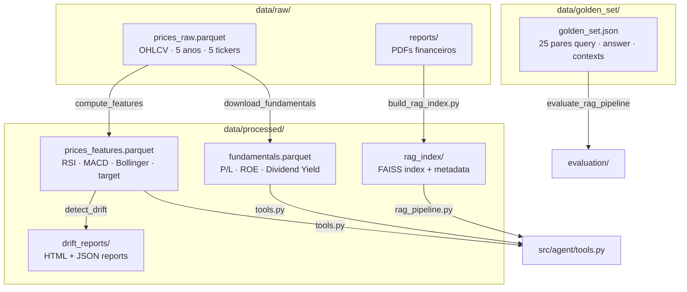
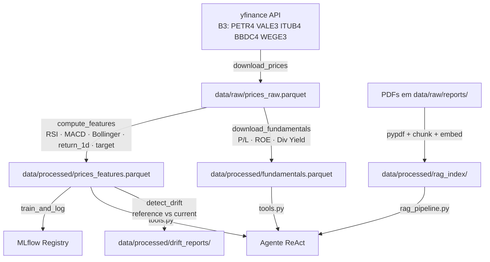
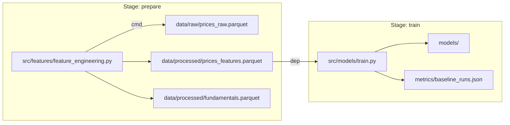
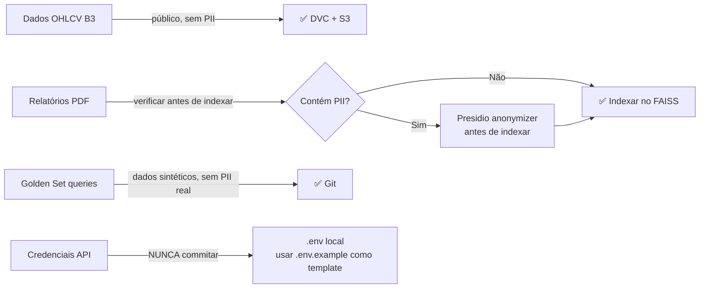

# data/ — Gestão de Dados

Dados versionados com DVC organizados em camadas: raw → processed → golden_set. Cobre o **Data Management** do MLOps Nível 2 (GAP 08).

---

## Sumário

1. [Visão Geral](#visão-geral)
2. [Estrutura de Diretórios](#estrutura-de-diretórios)
3. [Fluxo de Dados](#fluxo-de-dados)
4. [Versionamento DVC](#versionamento-dvc)
5. [Golden Set](#golden-set)
6. [Política de Dados Sensíveis](#política-de-dados-sensíveis)

---

## Visão Geral

```
data/
├── raw/                          # Dados brutos (NÃO commitar — usar DVC)
│   ├── prices_raw.parquet        # OHLCV histórico 5 anos (yfinance)
│   └── reports/                  # PDFs financeiros para RAG (opcional)
├── processed/                    # Dados transformados
│   ├── prices_features.parquet  # Features técnicas + target binário
│   ├── fundamentals.parquet     # P/L, ROE, Dividend Yield
│   └── drift_reports/           # Reports Evidently HTML + JSON
└── golden_set/
    └── golden_set.json           # 25 pares de avaliação
```

**Princípio de camadas:**

| Camada | Quem produz | Quem consome | Versionamento |
|--------|-------------|--------------|---------------|
| `raw/` | `yfinance` / upload manual | `compute_features()` | DVC |
| `processed/` | `feature_engineering.py` | `train.py` + agente tools | DVC |
| `golden_set/` | Criação manual | `evaluation/` | Git |

---

## Estrutura de Diretórios



---

## Fluxo de Dados



---

## Versionamento DVC

Apenas os dados de `data/raw/` e `data/processed/` são rastreados pelo DVC (não comitados no Git).

### Pipeline DVC (`dvc.yaml`)



### Comandos DVC

```bash
# Executar toda a pipeline
dvc repro

# Executar stage específico
dvc repro prepare
dvc repro train

# Verificar status dos stages
dvc status

# Ver DAG da pipeline
dvc dag
```

### `.dvcignore`

```gitignore
# Arquivos ignorados pelo DVC (dentro de data/)
*.log
*.tmp
drift_reports/*.html
drift_reports/*.json
rag_index/
```

---

## Golden Set

### Estrutura

O arquivo `data/golden_set/golden_set.json` contém **25 pares** de avaliação:

```json
[
  {
    "id": "ar-001",
    "query": "Qual ação teve maior retorno em 2024?",
    "expected_answer": "Em 2024, VALE3.SA teve o maior retorno com aproximadamente 32.10%...",
    "contexts": [
      "Série histórica de preços mostra retorno anual de VALE3 em 2024..."
    ],
    "tool_expected": "annual_returns",
    "category": "annual_returns"
  }
]
```

### Distribuição por Categoria

| Categoria | IDs | Quantidade |
|-----------|-----|------------|
| `annual_returns` | ar-001 a ar-005 | 5 |
| `compare_fundamentals` | fd-001 a fd-006 | 6 |
| `portfolio_risk` | pr-001 a pr-005 | 5 |
| `technical_signal` | ts-001 a ts-005 | 5 |
| `search_reports` | sr-001 a sr-004 | 4 |
| **Total** | | **25** |

### Por que Golden Set separado do código?

O golden set é commitado no Git (não no DVC) porque:
1. É pequeno (~10KB) e não contém dados sensíveis
2. Precisa ser versionado junto com o código de avaliação
3. Mudanças no golden set devem aparecer no histórico Git

---

## Política de Dados Sensíveis



**Regras:**
- `data/raw/*.parquet` e `data/processed/*.parquet` → DVC, nunca Git
- Credenciais de API → `.env` local (`.env.example` como template)
- PDFs com PII → anonimizar com Presidio antes de indexar no RAG
- Golden set → pode ser commitado no Git (sem dados pessoais)
