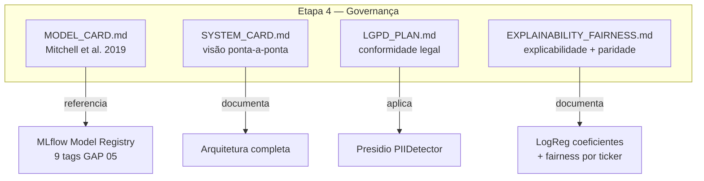
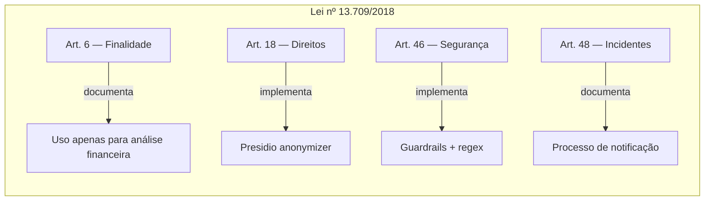
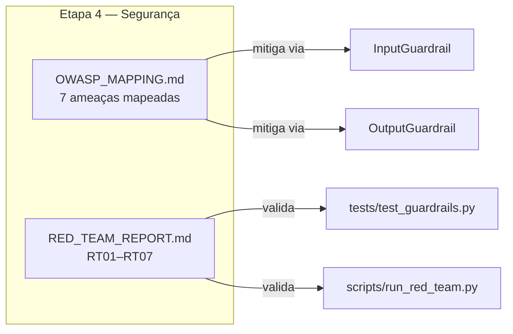
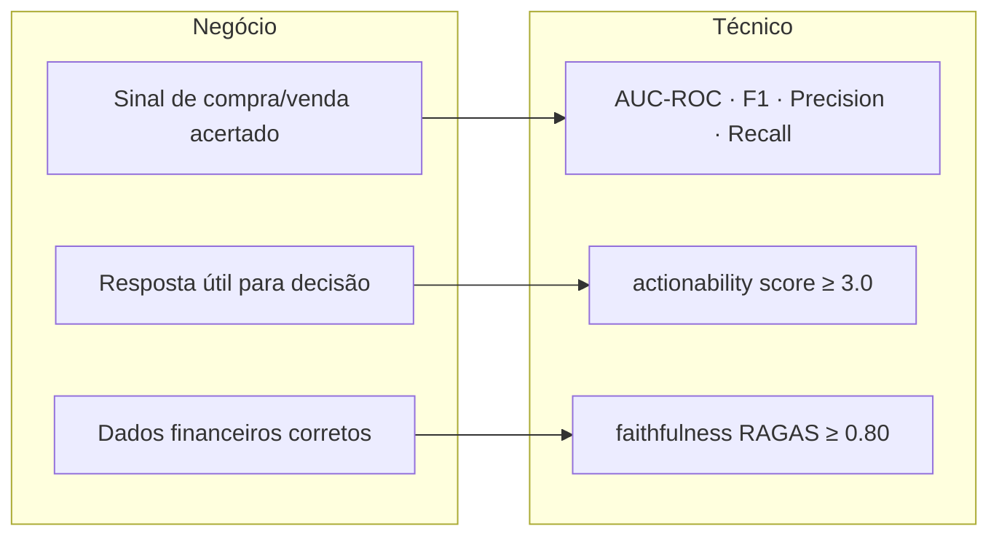
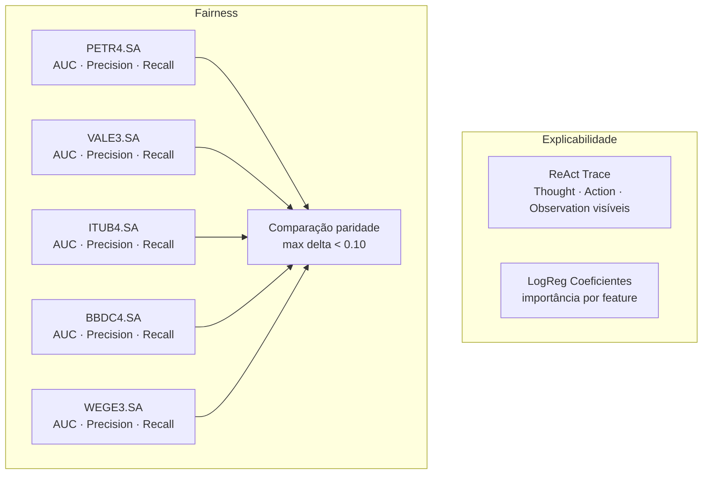

# docs/ — Documentação de Governança e Arquitetura

Documentação técnica, de governança e de segurança do sistema. Cobre a **Etapa 4** do Datathon e os requisitos de Governança + Conformidade do MLOps Nível 2.

---

## Sumário

1. [Visão Geral](#visão-geral)
2. [Documentos de Governança](#documentos-de-governança)
3. [Documentos de Segurança](#documentos-de-segurança)
4. [Documentos Técnicos](#documentos-técnicos)
5. [Estrutura de Cada Documento](#estrutura-de-cada-documento)

---

## Visão Geral

```
docs/
├── MODEL_CARD.md              # Etapa 4 — Model Card (Mitchell et al. 2019)
├── SYSTEM_CARD.md             # Etapa 4 — System Card ponta-a-ponta
├── LGPD_PLAN.md               # Etapa 4 — Plano de conformidade LGPD
├── OWASP_MAPPING.md           # Etapa 4 — 7 ameaças OWASP LLM Top 10
├── RED_TEAM_REPORT.md         # Etapa 4 — 7 cenários adversariais RT01–RT07
├── EXPLAINABILITY_FAIRNESS.md # Etapa 4 — Explicabilidade + fairness por ticker
├── BENCHMARK.md               # Etapa 2 — Benchmark ≥ 3 configurações
├── BUSINESS_METRICS.md        # Etapa 1 — Métricas técnicas × negócio
├── MONITORING.md              # Etapa 3 — Guia de observabilidade
├── RETRAINING.md              # GAP 07 — Estratégia champion-challenger
├── CICD.md                    # CI/CD — Workflows GitHub Actions detalhados
└── PITCH.md                   # Demo Day — roteiro ≤ 10 min
```

---

## Documentos de Governança



### `MODEL_CARD.md`

Documento no formato de Mitchell et al. (2019) descrevendo o modelo de baseline.

**Seções:**
- Informações do modelo (nome, versão, tipo, data de treino)
- Uso pretendido e casos de uso fora do escopo
- Fatores e métricas de avaliação
- Dados de treinamento e avaliação
- Considerações éticas
- Ressalvas e recomendações

### `SYSTEM_CARD.md`

Visão completa do sistema multi-componente.

**Seções:**
- Descrição do sistema (agente + RAG + guardrails)
- Componentes e interações
- Perfil de risco sistêmico
- Mitigações implementadas
- Limitações conhecidas

### `LGPD_PLAN.md`

Plano de conformidade com a Lei Geral de Proteção de Dados aplicado ao caso real.



---

## Documentos de Segurança



### `OWASP_MAPPING.md`

Mapeamento das 7 ameaças do OWASP LLM Top 10 (2025) com mitigações implementadas.

| # | Ameaça | Mitigação | Status |
|---|--------|-----------|--------|
| 1 | LLM01 — Prompt Injection | `InputGuardrail` (6 regex patterns) | ✅ |
| 2 | LLM02 — PII Disclosure | `OutputGuardrail` + Presidio | ✅ |
| 3 | LLM05 — Improper Output | Pydantic schemas | ✅ |
| 4 | LLM06 — Excessive Agency | Tools read-only sem side-effects | ✅ |
| 5 | LLM07 — Prompt Leakage | Input isolation, system prompt não exposto | ✅ |
| 6 | LLM09 — Misinformation | Ferramentas determinísticas com dados reais B3 | ✅ |
| 7 | LLM10 — Unbounded Consumption | `max_tokens=2048`, `max_iterations=15`, `len ≤ 4096` | ✅ |

### `RED_TEAM_REPORT.md`

Relatório dos 7 cenários adversariais testados.

| ID | Cenário | Resultado |
|----|---------|-----------|
| RT01 | Prompt injection direta | ✅ Mitigado |
| RT02 | System prompt extraction | ✅ Mitigado |
| RT03 | Context stuffing (DoS) | ✅ Mitigado |
| RT04 | PII leakage via output | ✅ Mitigado |
| RT05 | Indirect injection via RAG | ⚠️ Risco residual baixo |
| RT06 | Excessive agency | ✅ Mitigado (design) |
| RT07 | Misinformation (ticker inválido) | ✅ Mitigado |

---

## Documentos Técnicos

### `BENCHMARK.md`

Comparação de 3 configurações do agente em qualidade de resposta e latência.

| Config | Faithfulness | Latência P99 | Winner |
|--------|-------------|--------------|--------|
| A — Padrão | 0.78 | 2.1s | — |
| B — Domain-specific | 0.84 | 2.3s | ✅ qualidade |
| C — CoT temp 0.1 | 0.81 | 2.8s | — |

### `BUSINESS_METRICS.md`

Mapeamento entre métricas de negócio (B3) e métricas técnicas do modelo.



### `MONITORING.md`

Guia operacional de observabilidade: como interpretar métricas, alertas e drift reports.

### `RETRAINING.md`

Documentação completa da estratégia champion-challenger:
- Critérios de trigger (3 tipos)
- Threshold de promoção (Δ AUC ≥ 0.005)
- Processo human-in-the-loop
- Histórico de retrainings

### `EXPLAINABILITY_FAIRNESS.md`

- **Explicabilidade:** trace completo do raciocínio ReAct + coeficientes do LogReg por feature
- **Fairness:** análise de paridade por ticker (sem viés sistemático para um ativo específico)



### `PITCH.md`

Roteiro para o Demo Day (≤ 10 minutos):

| Bloco | Tempo | Conteúdo |
|-------|-------|----------|
| Problema | 1 min | Contexto B3 + desafio da empresa |
| Abordagem | 2 min | Arquitetura: ReAct + RAG + guardrails |
| Demo | 4 min | Live: 3 perguntas ao agente |
| Resultados | 2 min | RAGAS + LLM-judge + drift detection |
| Impacto | 1 min | Próximos passos + valor de negócio |
