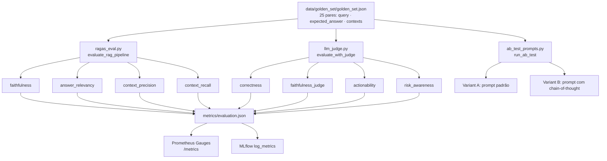
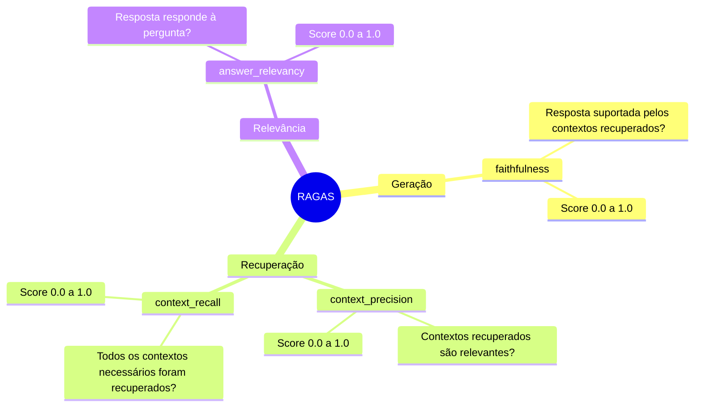
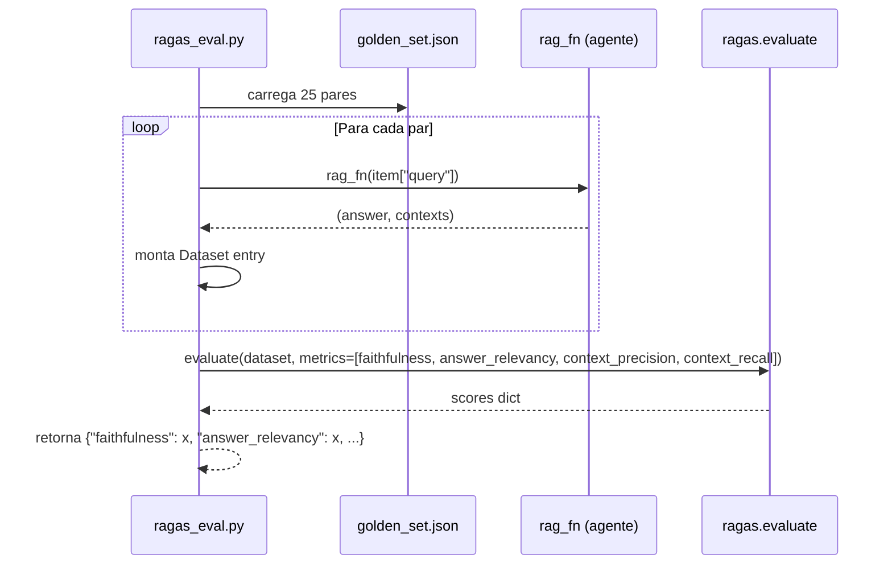
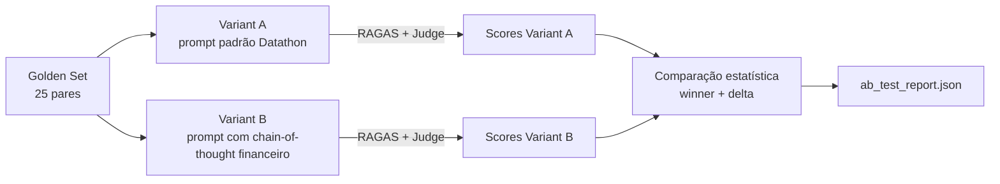
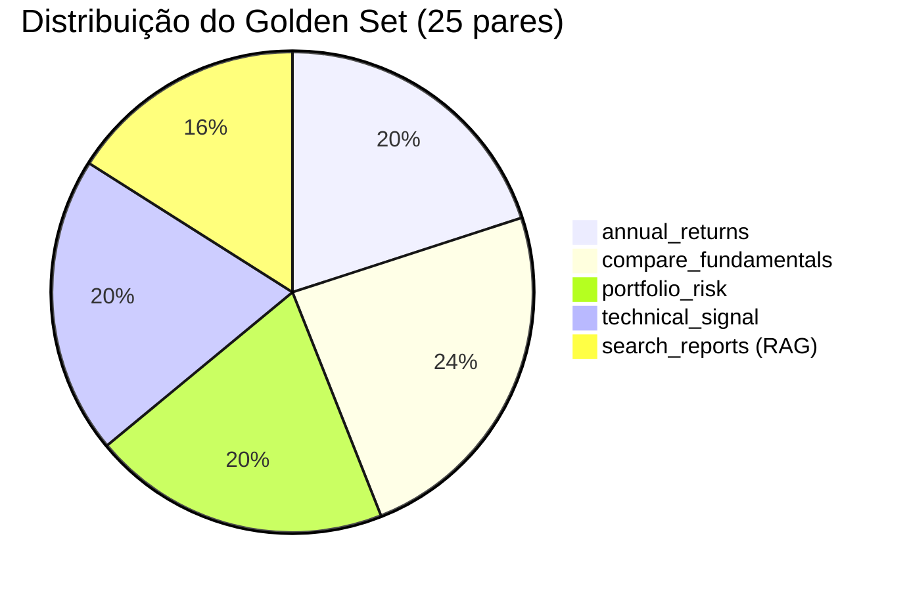

# evaluation/ — Avaliação de Qualidade do Agente

Módulo de avaliação do pipeline RAG e do agente financeiro com RAGAS, LLM-as-Judge e A/B test de prompts. Cobre a **Etapa 3** do Datathon.

---

## Sumário

1. [Visão Geral](#visão-geral)
2. [Pipeline de Avaliação](#pipeline-de-avaliação)
3. [RAGAS — 4 Métricas](#ragas--4-métricas)
4. [LLM-as-Judge](#llm-as-judge)
5. [A/B Test de Prompts](#ab-test-de-prompts)
6. [Golden Set](#golden-set)
7. [Uso](#uso)

---

## Visão Geral

```
evaluation/
├── __init__.py
├── ragas_eval.py        # 4 métricas RAGAS obrigatórias
├── llm_judge.py         # 4 critérios de julgamento
└── ab_test_prompts.py   # A/B test entre configurações de prompt
```

---

## Pipeline de Avaliação



---

## RAGAS — 4 Métricas

O módulo replica **verbatim** o snippet da Etapa 3 do guia oficial do Datathon.

### Métricas



### Como funciona internamente



### API

```python
def evaluate_rag_pipeline(
    golden_set_path: str,
    rag_fn: Callable[[str], tuple[str, list[str]]],
) -> dict[str, float]:
    """Avalia pipeline RAG contra golden set.

    Args:
        golden_set_path: Caminho para JSON com golden set.
        rag_fn: Função que recebe query e retorna (answer, contexts).

    Returns:
        Dicionário com 4 métricas RAGAS.
    """
```

---

## LLM-as-Judge

Avaliação qualitativa onde um LLM juiz puntua as respostas do agente segundo 4 critérios, incluindo 2 de negócio.

### Critérios

| Critério | Tipo | Pergunta de avaliação |
|----------|------|----------------------|
| `correctness` | Técnico | "A resposta está factualmente correta?" |
| `faithfulness` | Técnico | "A resposta é fiel às fontes/dados?" |
| `actionability` | **Negócio** | "A resposta ajuda o usuário a tomar uma decisão?" |
| `risk_awareness` | **Negócio** | "A resposta aponta limitações e riscos relevantes?" |

### Fluxo do Julgamento

```mermaid
flowchart LR
    subgraph Por par do golden set
        Q[query] & A[answer] & GT[ground_truth] --> PROMPT[Prompt de julgamento<br/>criterio + rubrica 1-5]
        PROMPT --> LLM[LLM Juiz]
        LLM --> SCORE[score: 1-5<br/>justification: str]
    end

    SCORE -->|média por critério| FINAL[dict{criterio: avg_score}]
```

### Escala de Pontuação

| Score | Descrição |
|-------|-----------|
| 1 | Completamente errado / irrelevante |
| 2 | Parcialmente correto, mas com erros significativos |
| 3 | Razoável, mas incompleto |
| 4 | Bom, com pequenas omissões |
| 5 | Excelente, completo e preciso |

### API

```python
CRITERIA: tuple[str, ...] = (
    "correctness",
    "faithfulness",
    "actionability",
    "risk_awareness",
)

def evaluate_with_judge(
    golden_set_path: str,
    rag_fn: Callable[[str], tuple[str, list[str]]],
    judge_model: str = "gpt-4o-mini",
) -> dict[str, float]:
    """Retorna score médio (1-5) por critério."""
```

---

## A/B Test de Prompts

Compara diferentes configurações do prompt ReAct para identificar a melhor performance no domínio financeiro.



### Configurações Testadas

| Configuração | Descrição | Temperatura |
|-------------|-----------|-------------|
| A | Prompt padrão ReAct (guia Datathon) | 0.0 |
| B | Prompt com instruções domain-specific financeiro | 0.0 |
| C | Prompt B com temperatura 0.1 | 0.1 |

---

## Golden Set

O golden set contém **25 pares** de avaliação cobrindo todos os tipos de pergunta financeira suportados pelo agente.



### Estrutura do JSON

```json
[
  {
    "id": "ar-001",
    "query": "Qual ação teve maior retorno em 2024?",
    "expected_answer": "Em 2024, VALE3 teve o maior retorno com aproximadamente 32%...",
    "contexts": ["Contexto sobre retornos anuais B3..."],
    "tool_expected": "annual_returns",
    "category": "annual_returns"
  }
]
```

**Campos por par:**

| Campo | Tipo | Descrição |
|-------|------|-----------|
| `id` | str | Identificador único |
| `query` | str | Pergunta para o agente |
| `expected_answer` | str | Resposta esperada (ground truth) |
| `contexts` | list[str] | Contextos de referência para RAGAS |
| `tool_expected` | str | Tool que deve ser chamada |
| `category` | str | Categoria da pergunta |

---

## Uso

### Via Makefile

```bash
make eval
# → metrics/evaluation.json
# → métricas expostas em /metrics (Prometheus)
```

### Diretamente

```bash
python scripts/run_evaluation.py \
  --golden-set data/golden_set/golden_set.json \
  --output metrics/evaluation.json
```

### Programático

```python
from evaluation.ragas_eval import evaluate_rag_pipeline
from evaluation.llm_judge import evaluate_with_judge

def my_rag_fn(query: str) -> tuple[str, list[str]]:
    # chama o agente e retorna (answer, contexts)
    ...

# RAGAS
ragas_scores = evaluate_rag_pipeline(
    golden_set_path="data/golden_set/golden_set.json",
    rag_fn=my_rag_fn,
)
print(ragas_scores)
# {"faithfulness": 0.82, "answer_relevancy": 0.79, "context_precision": 0.85, "context_recall": 0.71}

# LLM-as-Judge
judge_scores = evaluate_with_judge(
    golden_set_path="data/golden_set/golden_set.json",
    rag_fn=my_rag_fn,
    judge_model="gpt-4o-mini",
)
print(judge_scores)
# {"correctness": 4.2, "faithfulness": 4.0, "actionability": 3.8, "risk_awareness": 3.5}
```

### Interpretar Resultados

| Métrica RAGAS | Alerta | Crítico |
|---------------|--------|---------|
| `faithfulness` | < 0.70 | < 0.50 |
| `answer_relevancy` | < 0.70 | < 0.50 |
| `context_precision` | < 0.65 | < 0.45 |
| `context_recall` | < 0.65 | < 0.45 |

| Critério Judge | Alerta | Crítico |
|----------------|--------|---------|
| `correctness` | < 3.5 | < 2.5 |
| `actionability` | < 3.0 | < 2.0 |
| `risk_awareness` | < 3.0 | < 2.0 |
