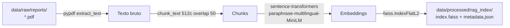
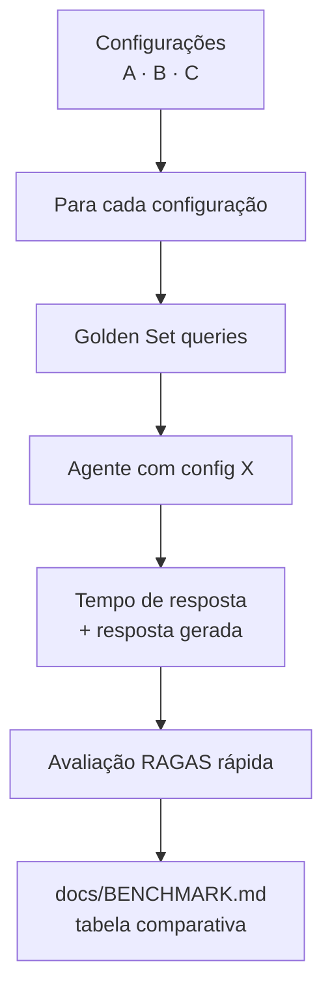
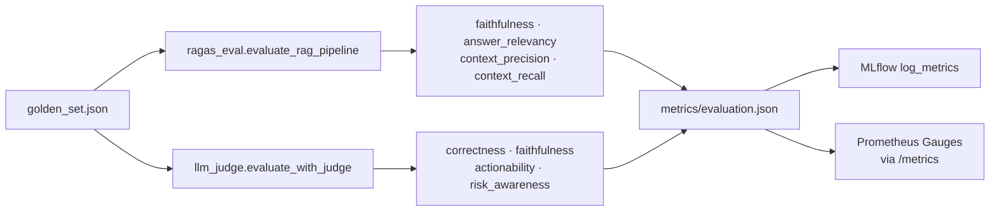
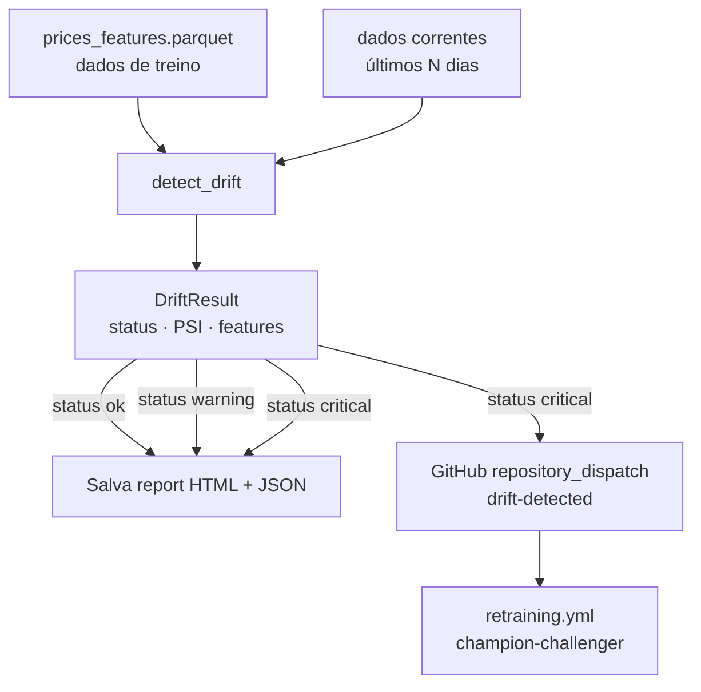
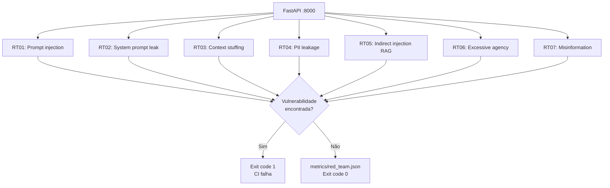
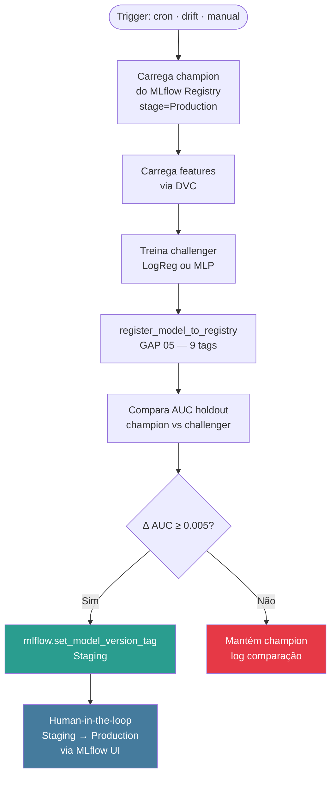
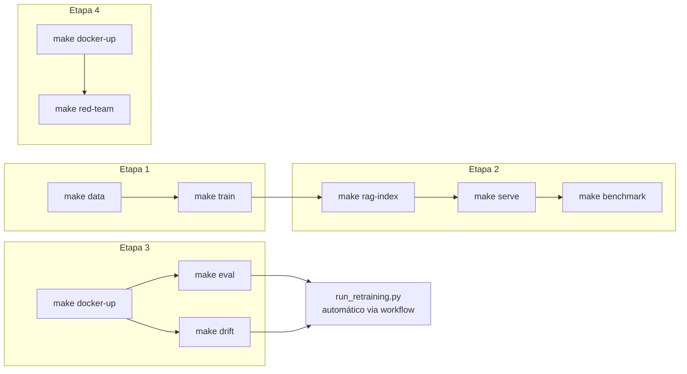

# scripts/ — Scripts de Operações

Scripts de linha de comando para operações offline: indexação RAG, benchmark, avaliação, drift check, red team e retraining.

---

## Sumário

1. [Visão Geral](#visão-geral)
2. [Scripts Disponíveis](#scripts-disponíveis)
3. [Fluxos de Execução](#fluxos-de-execução)
4. [Uso via Makefile](#uso-via-makefile)

---

## Visão Geral

```
scripts/
├── __init__.py
├── build_rag_index.py    # Etapa 2 — indexa PDFs → FAISS
├── run_benchmark.py      # Etapa 2 — benchmark ≥ 3 configurações
├── run_evaluation.py     # Etapa 3 — RAGAS + LLM-judge
├── run_drift_check.py    # Etapa 3 — Evidently + PSI
├── run_red_team.py       # Etapa 4 — 7 cenários adversariais
└── run_retraining.py     # GAP 07 — champion-challenger
```

Todos os scripts são executáveis diretamente como módulos Python (`python scripts/<script>.py`) ou via Makefile.

---

## Scripts Disponíveis

### `build_rag_index.py`

Lê PDFs de `data/raw/reports/`, divide em chunks, gera embeddings e salva o índice FAISS em `data/processed/rag_index/`.



**Uso:**
```bash
make rag-index
# ou
python scripts/build_rag_index.py --input data/raw/reports/ --output data/processed/rag_index/
```

---

### `run_benchmark.py`

Avalia o agente em 3+ configurações distintas de LLM e prompt, reportando latência e qualidade.



**Configurações benchmarkadas:**

| Config | Modelo | Temperatura | Prompt |
|--------|--------|-------------|--------|
| A | `qwen2.5-3b-instruct` | 0.0 | Padrão Datathon |
| B | `qwen2.5-3b-instruct` | 0.0 | Domain-specific financeiro |
| C | `qwen2.5-3b-instruct` | 0.1 | Domain-specific + CoT |

**Uso:**
```bash
make benchmark
# ou
python scripts/run_benchmark.py --golden-set data/golden_set/golden_set.json
```

---

### `run_evaluation.py`

Executa a avaliação completa (RAGAS + LLM-as-judge) e salva resultados.



**Uso:**
```bash
make eval
# ou
python scripts/run_evaluation.py \
  --golden-set data/golden_set/golden_set.json \
  --output metrics/evaluation.json \
  --mlflow-uri http://localhost:5000
```

**Saída (`metrics/evaluation.json`):**
```json
{
  "ragas": {
    "faithfulness": 0.82,
    "answer_relevancy": 0.79,
    "context_precision": 0.85,
    "context_recall": 0.71
  },
  "judge": {
    "correctness": 4.2,
    "faithfulness": 4.0,
    "actionability": 3.8,
    "risk_awareness": 3.5
  },
  "timestamp": "2026-05-02T10:00:00Z"
}
```

---

### `run_drift_check.py`

Detecta drift entre os dados de treino (referência) e dados correntes, salva report HTML/JSON e opcionalmente dispara retraining.



**Uso:**
```bash
make drift
# ou
python scripts/run_drift_check.py \
  --reference data/processed/prices_features.parquet \
  --output data/processed/drift_reports/
```

---

### `run_red_team.py`

Executa os 7 cenários adversariais contra a API em execução e reporta vulnerabilidades encontradas.



**Uso:**
```bash
# API deve estar no ar: make serve ou make docker-up
make red-team
# ou
python scripts/run_red_team.py --api-url http://localhost:8000
```

**Saída (`metrics/red_team.json`):**
```json
{
  "scenarios": [
    {"id": "RT01", "status": "mitigated", "details": "Input bloqueado pelo guardrail"},
    {"id": "RT02", "status": "mitigated", "details": "System prompt não exposto"},
    {"id": "RT05", "status": "residual_risk", "details": "Risco baixo, não explorado"}
  ],
  "vulnerabilities_found": 0,
  "timestamp": "2026-05-02T10:00:00Z"
}
```

---

### `run_retraining.py`

Implementa o pipeline champion-challenger para decidir se um novo modelo deve ser promovido.



**Threshold configurável:**
```python
DEFAULT_THRESHOLD = 0.005  # Δ AUC mínimo para promoção
```

**Uso:**
```bash
# Manual
python scripts/run_retraining.py \
  --reason "drift detectado" \
  --challenger-class LogisticRegressionBaseline

# Via workflow (automático)
gh workflow run retraining.yml \
  -f reason="drift-triggered" \
  -f challenger_class="LogisticRegressionBaseline"
```

---

## Fluxos de Execução



---

## Uso via Makefile

```bash
make data        # python -m src.features.feature_engineering
make train       # python -m src.models.train
make test        # pytest tests/ -x --cov=src --cov-fail-under=60
make serve       # uvicorn src.serving.app:app --port 8000
make rag-index   # python scripts/build_rag_index.py
make benchmark   # python scripts/run_benchmark.py
make eval        # python scripts/run_evaluation.py
make drift       # python scripts/run_drift_check.py
make red-team    # python scripts/run_red_team.py
make docker-up   # docker compose up -d
make docker-down # docker compose down
```
