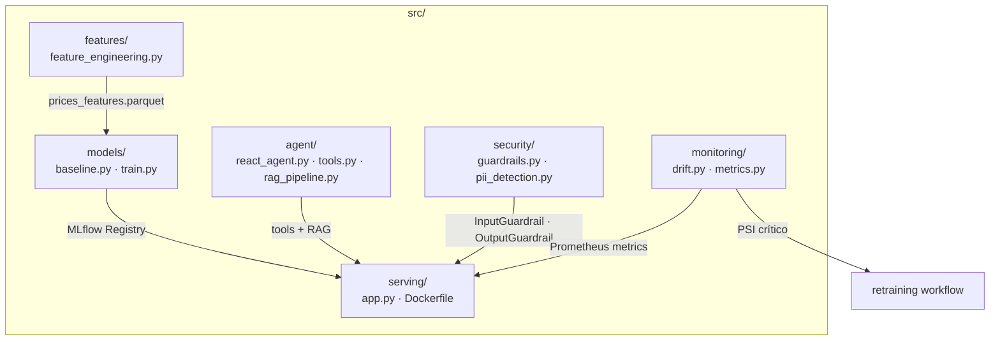
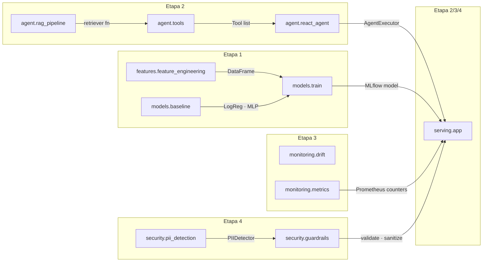

# src/ — Código-Fonte Principal

Pacote Python `mlet-phase5` contendo toda a lógica de negócio do sistema: feature engineering, modelos, agente, serving, monitoramento e segurança.

---

## Sumário

1. [Visão Geral](#visão-geral)
2. [Mapa de Módulos](#mapa-de-módulos)
3. [Diagrama de Dependências](#diagrama-de-dependências)
4. [Módulos](#módulos)
5. [Padrões Aplicados](#padrões-aplicados)

---

## Visão Geral

```
src/
├── features/          # Etapa 1 — Feature engineering financeira
├── models/            # Etapa 1 — Baselines + pipeline MLflow
├── agent/             # Etapa 2 — Agente ReAct + RAG + tools
├── serving/           # Etapa 2/3/4 — FastAPI + guardrails
├── monitoring/        # Etapa 3 — Drift detection + métricas Prometheus
└── security/          # Etapa 4 — Guardrails + detecção de PII
```

Cada submódulo possui seu próprio `README.md` detalhado.

---

## Mapa de Módulos



---

## Diagrama de Dependências



---

## Módulos

### `features/` — Feature Engineering

Responsável por baixar dados históricos da B3 via `yfinance` e calcular indicadores técnicos.

**Arquivo:** [`features/feature_engineering.py`](features/feature_engineering.py)

**Features calculadas:**

| Feature | Descrição |
|---------|-----------|
| `rsi_14` | Índice de Força Relativa (14 períodos) |
| `macd` | Moving Average Convergence Divergence |
| `macd_signal` | Linha de sinal do MACD |
| `macd_diff` | Histograma MACD |
| `bb_upper/lower` | Bandas de Bollinger superior/inferior |
| `bb_pct_b` | Percentual B das Bandas de Bollinger |
| `return_1d` | Retorno logarítmico 1 dia |
| `target` | Label binário: retorno > 0 no dia seguinte |

> Documentação completa: [`features/README.md`](features/README.md)

---

### `models/` — Modelos de Baseline

Define os dois baselines e o pipeline de treinamento com rastreamento MLflow.

**Arquivos:**
- [`models/baseline.py`](models/baseline.py) — `LogisticRegressionBaseline` + `MLPClassifierTorch`
- [`models/train.py`](models/train.py) — `train_and_log` + `register_model_to_registry`

> Documentação completa: [`models/README.md`](models/README.md)

---

### `agent/` — Agente ReAct

Implementa o agente conversacional financeiro com o padrão ReAct (Reason + Act).

**Arquivos:**
- [`agent/react_agent.py`](agent/react_agent.py) — `create_datathon_agent`
- [`agent/tools.py`](agent/tools.py) — 5 tools financeiras
- [`agent/rag_pipeline.py`](agent/rag_pipeline.py) — retriever FAISS

> Documentação completa: [`agent/README.md`](agent/README.md)

---

### `serving/` — API FastAPI

Serve o LLM quantizado e o agente ReAct via REST API com telemetria integrada.

**Arquivos:**
- [`serving/app.py`](serving/app.py) — endpoints: `/health` `/metrics` `/llm/complete` `/agent/chat`
- [`serving/Dockerfile`](serving/Dockerfile) — imagem multi-stage

> Documentação completa: [`serving/README.md`](serving/README.md)

---

### `monitoring/` — Observabilidade

Detecção de drift com Evidently e exposição de métricas operacionais via Prometheus.

**Arquivos:**
- [`monitoring/drift.py`](monitoring/drift.py) — `detect_drift` + PSI
- [`monitoring/metrics.py`](monitoring/metrics.py) — counters/histograms/gauges

> Documentação completa: [`monitoring/README.md`](monitoring/README.md)

---

### `security/` — Guardrails de Segurança

Validação de entrada contra prompt injection e sanitização de saída com remoção de PII.

**Arquivos:**
- [`security/guardrails.py`](security/guardrails.py) — `InputGuardrail` + `OutputGuardrail`
- [`security/pii_detection.py`](security/pii_detection.py) — `PIIDetector` (Presidio + regex)

> Documentação completa: [`security/README.md`](security/README.md)

---

## Padrões Aplicados

| Padrão | Onde | Descrição |
|--------|------|-----------|
| Type hints | Todas as funções públicas | `def fn(x: pd.DataFrame) -> str:` |
| Logging estruturado | Todos os módulos | `logger = logging.getLogger(__name__)` |
| Docstrings | Todas as funções públicas | Args + Returns documentados |
| `lru_cache` | `serving/app.py` | LLM e agente carregados uma vez por processo |
| Dataclasses | `monitoring/drift.py` | `DriftResult` com `to_dict()` |
| Pydantic models | `serving/app.py` | Request/Response validados |
| Sem `print()` | Todo o `src/` | Apenas `logger.info/warning/error` |
| `.env` para secrets | `serving/app.py` | `os.environ.get("LLM_MODEL_PATH")` |
