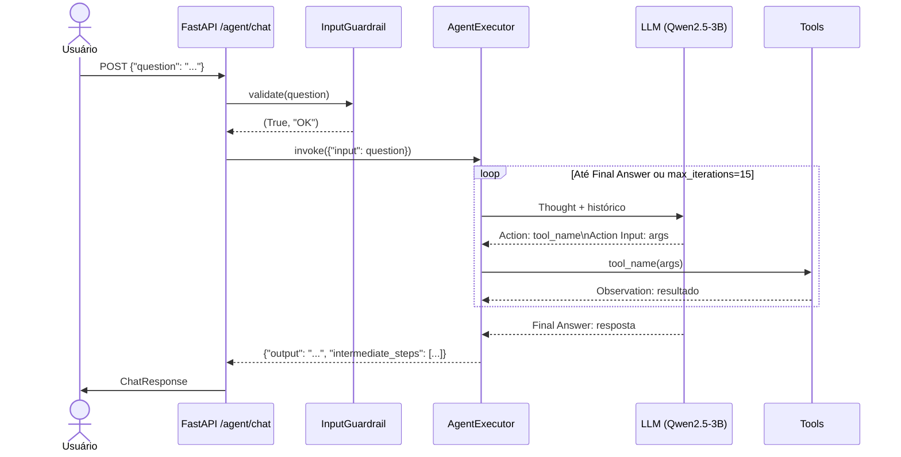
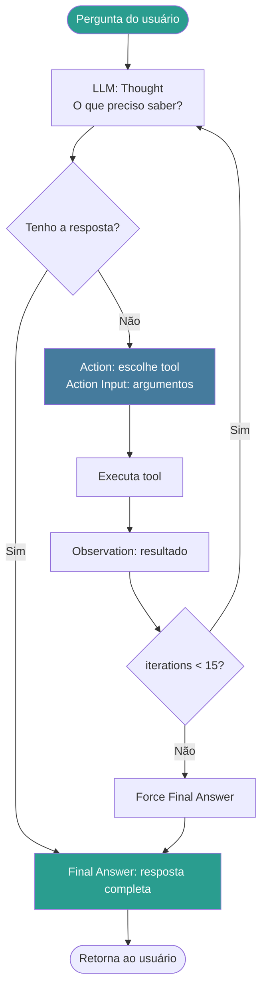
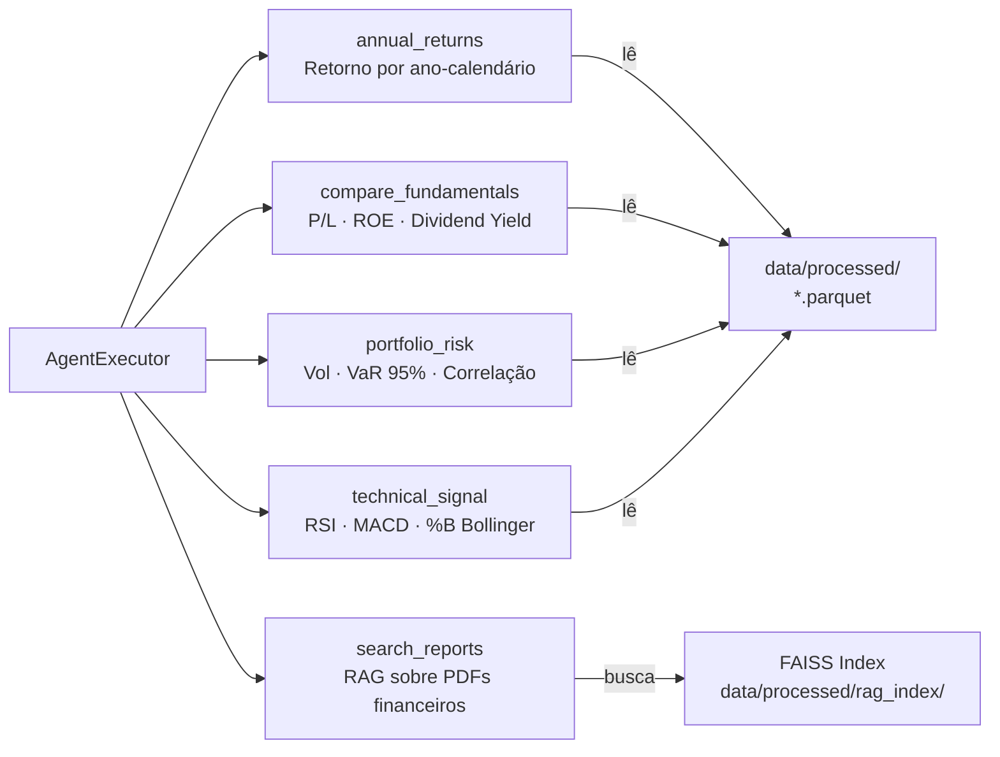
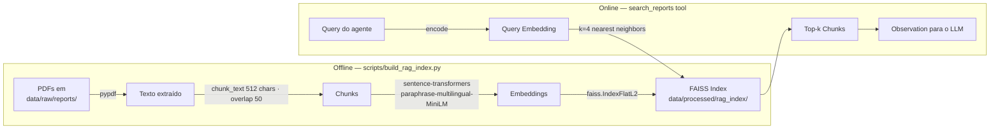

# src/agent/ — Agente ReAct Financeiro

Implementação do agente conversacional com o padrão **ReAct (Reason + Act)** para análise de ações B3. Cobre a **Etapa 2** do Datathon.

---

## Sumário

1. [Visão Geral](#visão-geral)
2. [Padrão ReAct](#padrão-react)
3. [Loop de Execução](#loop-de-execução)
4. [Tools Disponíveis](#tools-disponíveis)
5. [RAG Pipeline](#rag-pipeline)
6. [Arquivos](#arquivos)
7. [Uso](#uso)

---

## Visão Geral

```
src/agent/
├── __init__.py
├── react_agent.py     # create_datathon_agent() → AgentExecutor
├── tools.py           # 5 tools financeiras + build_default_tools()
└── rag_pipeline.py    # FAISS retriever sobre PDFs financeiros
```

**Dependências externas:** `langchain`, `langchain-openai`, `sentence-transformers`, `faiss-cpu`, `pypdf`

---

## Padrão ReAct

O agente segue o ciclo **Thought → Action → Observation** descrito em Yao et al. (2023). A cada turno, o LLM:

1. **Thought** — raciocina sobre o que precisa saber
2. **Action** — escolhe uma tool e formula o input
3. **Observation** — recebe o resultado da tool
4. Repete até formular a **Final Answer**



---

## Loop de Execução



**Configuração do `AgentExecutor`:**

| Parâmetro | Valor | Justificativa |
|-----------|-------|---------------|
| `max_iterations` | 15 | Previne loops infinitos (LLM10 OWASP) |
| `handle_parsing_errors` | `True` | Resiliência a saídas malformadas do LLM |
| `verbose` | `True` | Rastreio completo do pensamento (explicabilidade) |
| `return_intermediate_steps` | `True` | Expõe passos para auditoria |

---

## Tools Disponíveis



### Detalhes por Tool

#### `annual_returns`

Calcula retornos anuais para um ticker específico ou ranking completo.

```
Input:  "year=2024"               → ranking completo do ano
        "year=2024,ticker=PETR4"  → retorno de PETR4 em 2024
        ""                         → ranking de todos os anos
Output: "Ranking 2024 (maior→menor): VALE3.SA=32.10%, PETR4.SA=18.50%, ..."
```

#### `compare_fundamentals`

Compara P/L, ROE e Dividend Yield entre dois ou mais tickers.

```
Input:  "tickers=PETR4,VALE3"
        "tickers=PETR4,WEGE3,metric=dividend_yield"
Output: tabela com pe_ratio · roe · dividend_yield · sector
```

#### `portfolio_risk`

Relatório de risco: volatilidade anualizada, VaR 95% e matriz de correlação.

```
Input:  "tickers=PETR4,VALE3,WEGE3,weights=0.4,0.3,0.3"
        "tickers=PETR4,VALE3"  (pesos iguais automaticamente)
Output: volatilidade anualizada + VaR 95% (1d) + drawdown máximo + correlação
```

#### `technical_signal`

Sinal técnico atual baseado em RSI, MACD diff e %B Bollinger.

```
Input:  "ticker=PETR4"
Output: "PETR4.SA em 2024-12-31: RSI=45.2 (neutro); MACD diff=0.012 (alta); %B=0.65 (dentro das bandas)."
```

#### `search_reports` (RAG)

Busca semântica sobre relatórios financeiros indexados (PDFs).

```
Input:  "política de dividendos da PETR4"
Output: [trecho 1] ... --- [trecho 2] ...
```

---

## RAG Pipeline



**Configuração do retriever:**

| Parâmetro | Valor | Descrição |
|-----------|-------|-----------|
| Modelo de embedding | `paraphrase-multilingual-MiniLM-L12-v2` | Suporte multilíngue PT/EN |
| Chunk size | 512 chars | Balanceia contexto vs. precisão |
| Chunk overlap | 50 chars | Evita perda de contexto na divisão |
| `top_k` | 4 | Chunks retornados por query |
| Índice FAISS | `IndexFlatL2` | Busca exata por L2 distance |

---

## Arquivos

### `react_agent.py`

```python
def create_datathon_agent(
    tools: list[Tool],
    model_name: str = "gpt-4o-mini",
    temperature: float = 0.0,
) -> AgentExecutor:
```

- Cria o agente ReAct com o prompt padrão do Datathon
- Suporta LLM local (via `OPENAI_API_BASE`) ou externo
- Valida `len(tools) >= 3` com warning

### `tools.py`

```python
def build_default_tools(
    retriever: Callable[[str, int], list[str]] | None = None,
) -> list[Tool]:
```

- Retorna lista de 4-5 tools dependendo se `retriever` está disponível
- Cada função de tool aceita `str` e retorna `str`
- Parser `_parse_kv` aceita `"key=val,key2=val2"` ou JSON

### `rag_pipeline.py`

```python
class RAGPipeline:
    def search(self, query: str, top_k: int = 4) -> list[str]: ...
    def index_documents(self, pdf_paths: list[Path]) -> None: ...

def get_retriever() -> RAGPipeline | None:
```

- `get_retriever()` retorna `None` se o índice não existir (agente funciona sem RAG)
- Persistência automática em `data/processed/rag_index/`

---

## Uso

### Via API

```bash
curl -X POST http://localhost:8000/agent/chat \
  -H "Content-Type: application/json" \
  -d '{"question": "Qual ação teve maior retorno em 2024?"}'
```

### Programático

```python
from src.agent.rag_pipeline import get_retriever
from src.agent.react_agent import create_datathon_agent
from src.agent.tools import build_default_tools

retriever = get_retriever()
tools = build_default_tools(retriever=retriever.search if retriever else None)
agent = create_datathon_agent(tools=tools)

result = agent.invoke({"input": "Compare PETR4 e VALE3 pelo P/L."})
print(result["output"])
```

### Com LLM Local

```bash
export LLM_MODEL_PATH="models/qwen2.5-3b-instruct-q4_k_m.gguf"
export OPENAI_API_BASE="http://localhost:8001/v1"
export OPENAI_API_KEY="sk-local"
```
