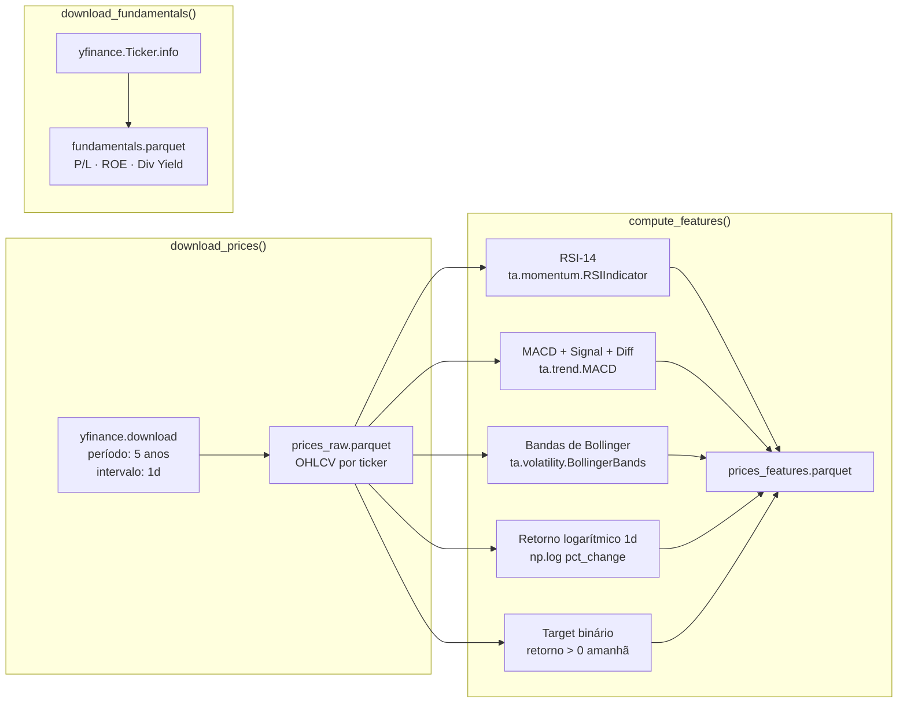
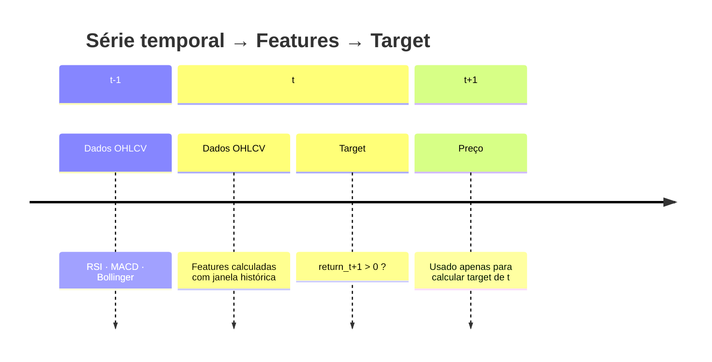

# src/features/ — Feature Engineering Financeira

Módulo responsável por baixar dados históricos da B3 via `yfinance`, calcular indicadores técnicos e produzir o dataset de features para os modelos de baseline. Cobre a **Etapa 1** do Datathon.

---

## Sumário

1. [Visão Geral](#visão-geral)
2. [Pipeline de Features](#pipeline-de-features)
3. [Features Calculadas](#features-calculadas)
4. [Tickers Cobertos](#tickers-cobertos)
5. [Schema do Dataset](#schema-do-dataset)
6. [Validação com Pandera](#validação-com-pandera)
7. [Uso](#uso)

---

## Visão Geral

```
src/features/
├── __init__.py
└── feature_engineering.py    # download_prices() + compute_features() + main()
```

**Dependências:** `yfinance>=0.2.40`, `pandas>=2.2.0`, `ta>=0.11.0`, `pandera>=0.19.0`

---

## Pipeline de Features



---

## Features Calculadas

### Indicadores Técnicos

| Feature | Biblioteca | Parâmetros | Interpretação |
|---------|-----------|------------|---------------|
| `rsi_14` | `ta.momentum.RSIIndicator` | window=14 | < 30 sobrevendido; > 70 sobrecomprado |
| `macd` | `ta.trend.MACD` | fast=12, slow=26 | Linha MACD |
| `macd_signal` | `ta.trend.MACD` | sign=9 | Linha de sinal |
| `macd_diff` | `ta.trend.MACD` | — | Histograma (macd - signal); > 0 = alta |
| `bb_upper` | `ta.volatility.BollingerBands` | window=20, std=2 | Banda superior |
| `bb_lower` | `ta.volatility.BollingerBands` | window=20, std=2 | Banda inferior |
| `bb_pct_b` | `ta.volatility.BollingerBands` | — | Posição relativa: 0=lower, 1=upper |
| `return_1d` | `np.log(close/close.shift(1))` | — | Retorno logarítmico diário |

### Feature Alvo

| Feature | Cálculo | Valores |
|---------|---------|---------|
| `target` | `1 if return_1d.shift(-1) > 0 else 0` | Binário: 0 ou 1 |

**Interpretação:** `target=1` significa que o preço de fechamento do próximo dia será maior que o atual.



---

## Tickers Cobertos

```python
DEFAULT_TICKERS: tuple[str, ...] = (
    "PETR4.SA",   # Petrobras PN
    "VALE3.SA",   # Vale ON
    "ITUB4.SA",   # Itaú Unibanco PN
    "BBDC4.SA",   # Bradesco PN
    "WEGE3.SA",   # WEG ON
)
```

Configurável em `configs/model_config.yaml`:

```yaml
tickers:
  - PETR4.SA
  - VALE3.SA
  - ITUB4.SA
  - BBDC4.SA
  - WEGE3.SA
```

---

## Schema do Dataset

### `data/processed/prices_features.parquet`

| Coluna | Tipo | Descrição |
|--------|------|-----------|
| `date` | `datetime64` | Data de pregão |
| `ticker` | `str` | Ticker B3 (ex: `PETR4.SA`) |
| `close` | `float64` | Preço de fechamento ajustado |
| `volume` | `float64` | Volume negociado |
| `rsi_14` | `float64` | RSI 14 períodos |
| `macd` | `float64` | Linha MACD |
| `macd_signal` | `float64` | Linha de sinal MACD |
| `macd_diff` | `float64` | Histograma MACD |
| `bb_upper` | `float64` | Bollinger superior |
| `bb_lower` | `float64` | Bollinger inferior |
| `bb_pct_b` | `float64` | %B Bollinger |
| `return_1d` | `float64` | Retorno logarítmico 1d |
| `target` | `int64` | Label binário (0 ou 1) |

### `data/processed/fundamentals.parquet`

| Coluna | Tipo | Descrição |
|--------|------|-----------|
| `ticker` | `str` | Ticker B3 |
| `pe_ratio` | `float64` | P/L (Price-to-Earnings) |
| `roe` | `float64` | Return on Equity |
| `dividend_yield` | `float64` | Dividend Yield |
| `sector` | `str` | Setor econômico |

---

## Validação com Pandera

O schema é validado automaticamente nos testes via `pandera`:

```python
# tests/test_features.py
FEATURE_SCHEMA = DataFrameSchema({
    "rsi_14":           Column(float, pa.Check.between(0, 100)),
    "bb_pct_b":         Column(float),
    "return_1d":        Column(float),
    "target":           Column(int, pa.Check.isin([0, 1])),
})
```

**Contratos validados:**
- Nenhuma feature com `null` após transformação
- `rsi_14` entre 0 e 100
- `target` apenas com valores 0 ou 1
- Número de linhas preservado após transformações

---

## Uso

### Via DVC (recomendado)

```bash
dvc repro prepare
```

### Via Makefile

```bash
make data
```

### Diretamente

```bash
python -m src.features.feature_engineering
```

### Programático

```python
from src.features.feature_engineering import download_prices, compute_features

# Download 5 anos de dados
prices_raw = download_prices(
    tickers=("PETR4.SA", "VALE3.SA"),
    period="5y",
    interval="1d",
)

# Calcular features
features = compute_features(prices_raw, target_horizon=1)

print(features.head())
print(f"Shape: {features.shape}")
print(f"Nulls: {features.isnull().sum().sum()}")
```

### Saídas Produzidas

```
data/
├── raw/
│   └── prices_raw.parquet           # OHLCV bruto por ticker
└── processed/
    ├── prices_features.parquet      # Features técnicas + target
    └── fundamentals.parquet         # P/L, ROE, Dividend Yield
```
