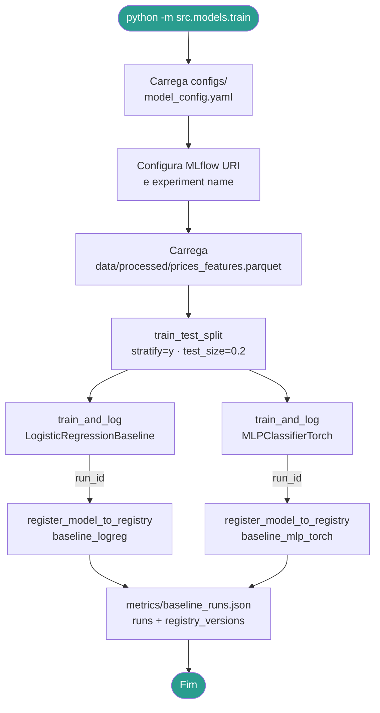
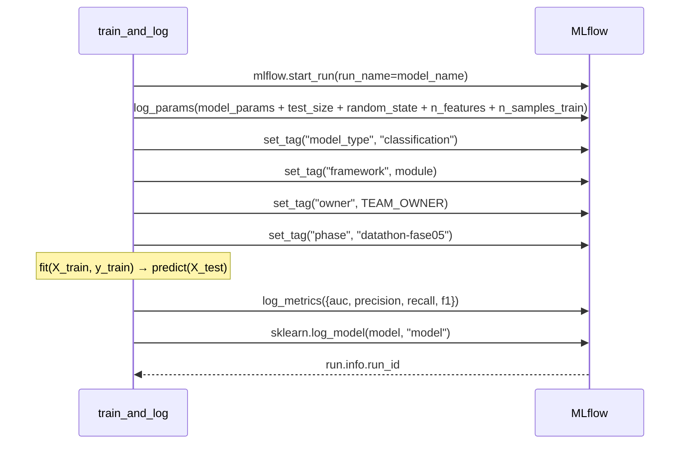
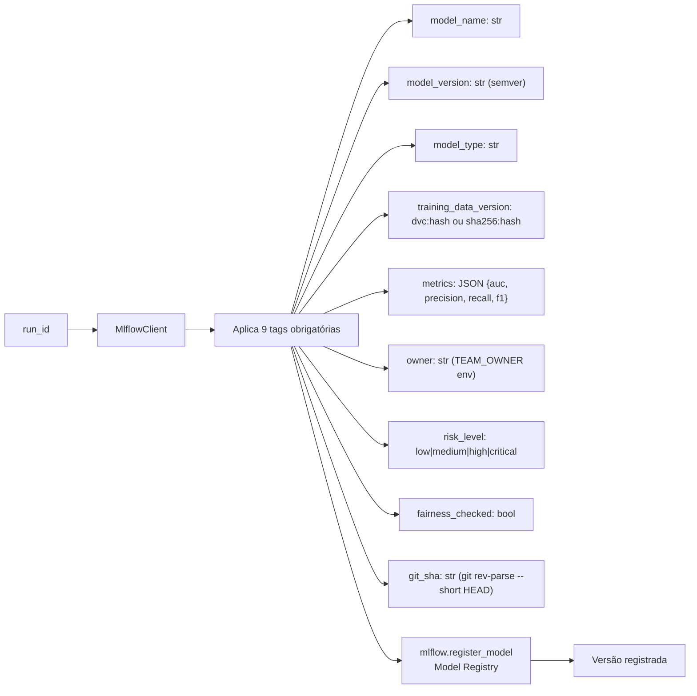
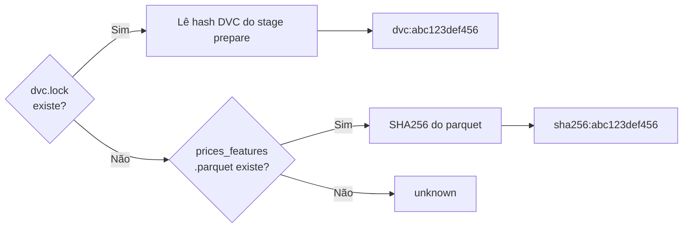
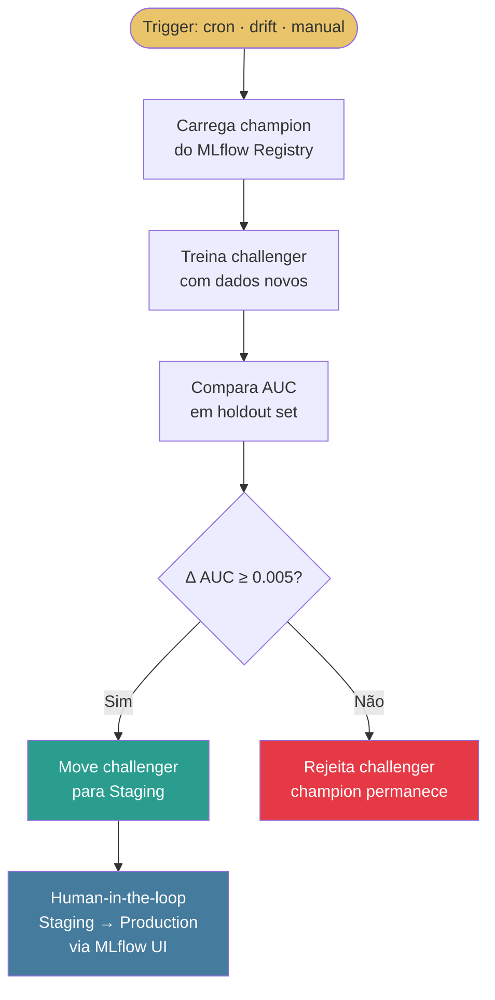

# src/models/ — Modelos de Baseline + Pipeline MLflow

Pipeline de treinamento com rastreamento padronizado no MLflow e governança Nível 2 (GAP 05). Cobre a **Etapa 1** do Datathon.

---

## Sumário

1. [Visão Geral](#visão-geral)
2. [Modelos Implementados](#modelos-implementados)
3. [Pipeline de Treinamento](#pipeline-de-treinamento)
4. [MLflow — Rastreamento Padronizado](#mlflow--rastreamento-padronizado)
5. [Governança — GAP 05](#governança--gap-05)
6. [Champion-Challenger](#champion-challenger)
7. [Arquivos](#arquivos)
8. [Uso](#uso)

---

## Visão Geral

```
src/models/
├── __init__.py
├── baseline.py    # LogisticRegressionBaseline + MLPClassifierTorch
└── train.py       # train_and_log() + register_model_to_registry() + main()
```

---

## Modelos Implementados

### `LogisticRegressionBaseline`

Wrapper sobre `sklearn.linear_model.LogisticRegression` com API sklearn compatível.

| Parâmetro | Padrão | Descrição |
|-----------|--------|-----------|
| `C` | 1.0 | Regularização inversa |
| `max_iter` | 1000 | Iterações máximas do solver |
| `solver` | `lbfgs` | Algoritmo de otimização |

**Uso para explicabilidade:** coeficientes acessíveis via `model.coef_` para análise de importância de features.

### `MLPClassifierTorch`

Rede neural feedforward implementada em **PyTorch** com sklearn API (`fit/predict/predict_proba`).

```mermaid
graph LR
    IN[Input<br/>n_features] --> H1[Hidden Layer<br/>hidden_dim=128]
    H1 --> DO[Dropout<br/>p=0.3]
    DO --> H2[Hidden Layer<br/>hidden_dim // 2]
    H2 --> OUT[Output<br/>2 classes]

    style IN fill:#264653
    style OUT fill:#2a9d8f
```



| Parâmetro | Padrão | Descrição |
|-----------|--------|-----------|
| `hidden_dim` | 128 | Dimensão da camada oculta principal |
| `dropout` | 0.3 | Taxa de dropout para regularização |
| `learning_rate` | 1e-3 | Taxa de aprendizado Adam |
| `epochs` | 50 | Épocas de treinamento |

---

## Pipeline de Treinamento



---

## MLflow — Rastreamento Padronizado

A função `train_and_log` replica **verbatim** o template da Etapa 1 do guia oficial.



**Métricas registradas:**

| Métrica | Função sklearn |
|---------|---------------|
| `auc` | `roc_auc_score` |
| `precision` | `precision_score(zero_division=0)` |
| `recall` | `recall_score(zero_division=0)` |
| `f1` | `f1_score(zero_division=0)` |

---

## Governança — GAP 05

A função `register_model_to_registry` aplica o **schema completo de 9 tags obrigatórias** do GAP 05 e registra o modelo no MLflow Model Registry.



**Resolução da versão de dados (`training_data_version`):**



---

## Champion-Challenger

O processo de retraining usa a estratégia champion-challenger para decidir se um novo modelo deve ser promovido.



> Implementado em `scripts/run_retraining.py` e orquestrado por `.github/workflows/retraining.yml`.

---

## Arquivos

### `baseline.py`

```python
FEATURE_COLUMNS: tuple[str, ...] = (
    "rsi_14", "macd", "macd_signal", "macd_diff",
    "bb_upper", "bb_lower", "bb_pct_b", "return_1d",
)

class LogisticRegressionBaseline:
    def fit(self, X: np.ndarray, y: np.ndarray) -> None: ...
    def predict(self, X: np.ndarray) -> np.ndarray: ...
    def predict_proba(self, X: np.ndarray) -> np.ndarray: ...

class MLPClassifierTorch:
    def fit(self, X: np.ndarray, y: np.ndarray) -> None: ...
    def predict(self, X: np.ndarray) -> np.ndarray: ...
    def predict_proba(self, X: np.ndarray) -> np.ndarray: ...
```

### `train.py`

```python
def train_and_log(
    df: pd.DataFrame,
    target_col: str,
    model_name: str,
    model_class,
    model_params: dict,
    test_size: float = 0.2,
    random_state: int = 42,
) -> str:  # retorna run_id

def register_model_to_registry(
    run_id: str,
    model_name: str,
    risk_level: str = "medium",
    fairness_checked: bool = False,
    owner: str | None = None,
) -> str:  # retorna versão registrada

def main() -> None:  # entrypoint DVC stage: train
```

---

## Uso

### Via DVC (recomendado)

```bash
dvc repro train
```

### Diretamente

```bash
python -m src.models.train
```

### Programático

```python
import mlflow
from src.models.baseline import LogisticRegressionBaseline
from src.models.train import train_and_log, register_model_to_registry

mlflow.set_tracking_uri("http://localhost:5000")
mlflow.set_experiment("mlet-phase5")

run_id = train_and_log(
    df=df,
    target_col="target",
    model_name="meu_modelo",
    model_class=LogisticRegressionBaseline,
    model_params={"C": 0.5, "max_iter": 500},
)

version = register_model_to_registry(
    run_id=run_id,
    model_name="meu_modelo",
    risk_level="low",
    fairness_checked=True,
)
```

### Acessar Experimentos

```bash
mlflow ui --backend-store-uri mlruns/
# → http://localhost:5000
```
