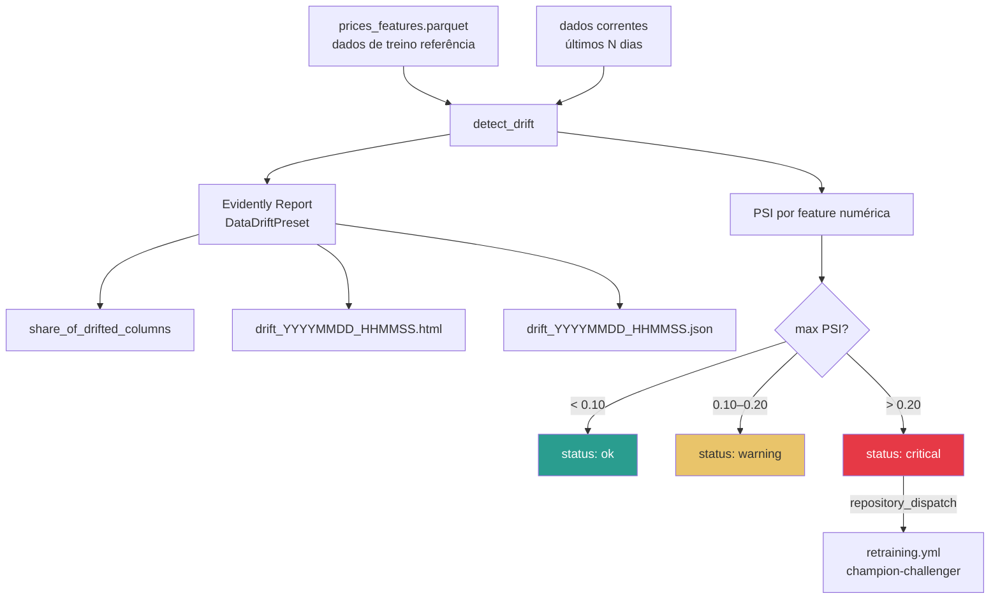
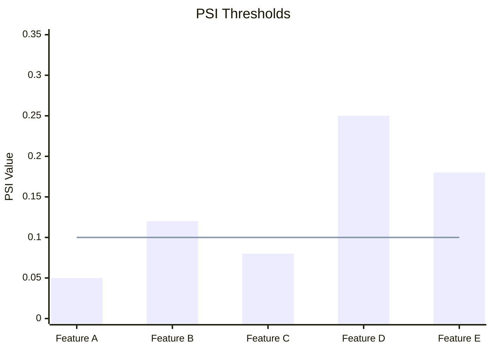
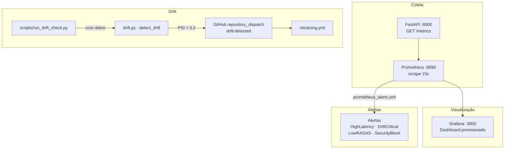
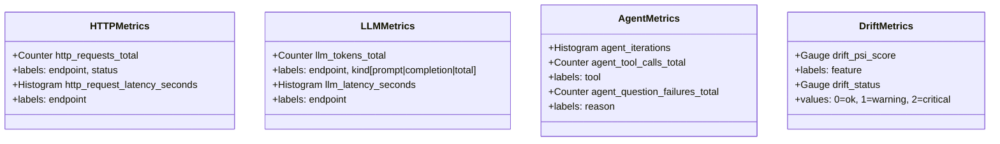
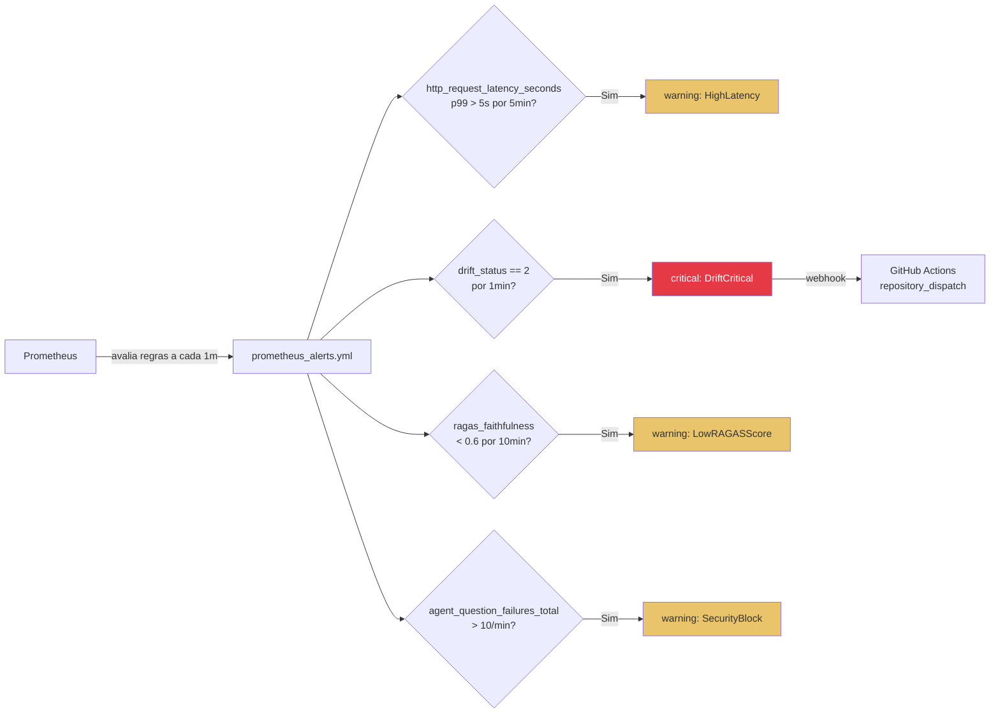

# src/monitoring/ — Observabilidade e Drift Detection

Módulo de observabilidade end-to-end: detecção de drift com Evidently + PSI e exposição de métricas operacionais via Prometheus. Cobre a **Etapa 3** do Datathon (GAP 01 e GAP 06).

---

## Sumário

1. [Visão Geral](#visão-geral)
2. [Drift Detection](#drift-detection)
3. [PSI — Population Stability Index](#psi--population-stability-index)
4. [Stack de Observabilidade](#stack-de-observabilidade)
5. [Métricas Prometheus](#métricas-prometheus)
6. [Fluxo de Alertas](#fluxo-de-alertas)
7. [Arquivos](#arquivos)
8. [Uso](#uso)

---

## Visão Geral

```
src/monitoring/
├── __init__.py
├── drift.py      # detect_drift() + population_stability_index() + DriftResult
└── metrics.py    # Prometheus counters / histograms / gauges + render_metrics()
```

**Dependências:** `evidently>=0.4.30,<0.5`, `prometheus-client>=0.20.0`

---

## Drift Detection

### Fluxo Completo



### `DriftResult` — Estrutura de Saída

```python
@dataclass
class DriftResult:
    share_of_drifted_columns: float     # 0.0 a 1.0
    drifted_features: list[str]         # features com drift detectado
    psi_per_feature: dict[str, float]   # PSI por feature numérica
    status: str                          # "ok" | "warning" | "critical"
    report_path: str | None             # caminho para o HTML salvo
```

---

## PSI — Population Stability Index

O PSI mede a estabilidade da distribuição de uma variável entre dois períodos.

### Fórmula

```
PSI = Σ (cur% - ref%) × ln(cur% / ref%)
```

Onde os bins são definidos pelos **quantis da distribuição de referência** (dados de treino).

### Thresholds

| PSI | Status | Ação |
|-----|--------|------|
| < 0.10 | `ok` | Nenhuma ação necessária |
| 0.10 – 0.20 | `warning` | Monitorar com atenção |
| > 0.20 | `critical` | Trigger de retraining automático |



### Implementação

```python
def population_stability_index(
    reference: pd.Series,
    current: pd.Series,
    bins: int = 10,
    eps: float = 1e-6,
) -> float:
    # Usa quantis da referência como bordas dos bins
    edges = np.unique(np.quantile(ref, np.linspace(0, 1, bins + 1)))
    ref_hist, _ = np.histogram(ref, bins=edges)
    cur_hist, _ = np.histogram(cur, bins=edges)
    ref_pct = ref_hist / max(ref_hist.sum(), 1) + eps
    cur_pct = cur_hist / max(cur_hist.sum(), 1) + eps
    return float(np.sum((cur_pct - ref_pct) * np.log(cur_pct / ref_pct)))
```

---

## Stack de Observabilidade



### Dashboard Grafana

O dashboard **"Datathon Fase 5 — Agente Financeiro"** é provisionado automaticamente em `configs/grafana/dashboards/agent_dashboard.json`.

**Painéis disponíveis:**

| Painel | Métrica | Tipo |
|--------|---------|------|
| Requisições por endpoint | `http_requests_total` | Time series |
| Latência P50/P95/P99 | `http_request_latency_seconds` | Histogram |
| Iterações do agente | `agent_iterations` | Histogram |
| Chamadas por tool | `agent_tool_calls_total` | Bar chart |
| Tokens LLM | `llm_tokens_total` | Time series |
| PSI por feature | `drift_psi_score` | Gauge |
| Status de drift | `drift_status` | Stat panel |
| Falhas de guardrail | `agent_question_failures_total` | Counter |

---

## Métricas Prometheus



**Função auxiliar:**

```python
def render_metrics() -> tuple[bytes, str]:
    """Retorna (payload, content_type) para exposição via FastAPI."""
```

---

## Fluxo de Alertas



---

## Arquivos

### `drift.py`

```python
DEFAULT_PSI_WARNING = 0.10
DEFAULT_PSI_CRITICAL = 0.20

def population_stability_index(
    reference: pd.Series,
    current: pd.Series,
    bins: int = 10,
    eps: float = 1e-6,
) -> float: ...

def detect_drift(
    reference_data: pd.DataFrame,
    current_data: pd.DataFrame,
    save_html: bool = True,
    report_dir: Path = REPORTS_DIR,
) -> DriftResult: ...
```

### `metrics.py`

```python
# Métricas exportadas
http_requests_total: Counter
http_request_latency_seconds: Histogram
llm_tokens_total: Counter
llm_latency_seconds: Histogram
agent_iterations: Histogram
agent_tool_calls_total: Counter
agent_question_failures_total: Counter
drift_psi_score: Gauge
drift_status: Gauge

def render_metrics() -> tuple[bytes, str]: ...
```

---

## Uso

### Checar drift manualmente

```bash
make drift
# ou
python scripts/run_drift_check.py
# → data/processed/drift_reports/drift_YYYYMMDD_HHMMSS.html
# → data/processed/drift_reports/drift_YYYYMMDD_HHMMSS.json
```

### Programático

```python
import pandas as pd
from src.monitoring.drift import detect_drift

reference = pd.read_parquet("data/processed/prices_features.parquet")
current = pd.read_parquet("data/processed/prices_features_latest.parquet")

result = detect_drift(reference, current)

print(f"Status: {result.status}")
print(f"Features com drift: {result.drifted_features}")
print(f"PSI máximo: {max(result.psi_per_feature.values()):.4f}")
```

### Configurar thresholds

Edite `configs/monitoring_config.yaml`:

```yaml
alerts:
  psi_warning: 0.10    # warning threshold
  psi_critical: 0.20   # critical threshold / retraining trigger
```
