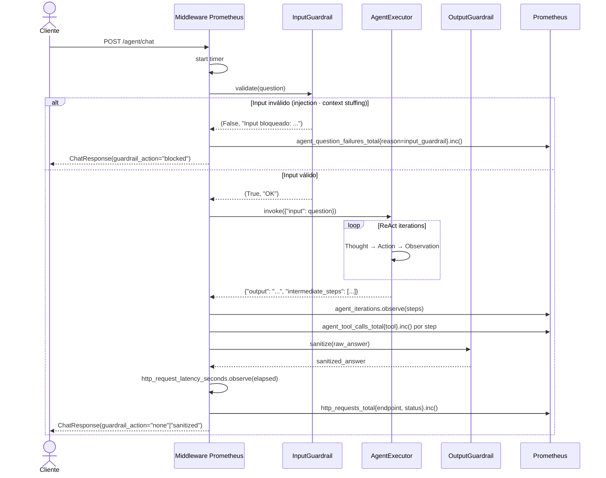
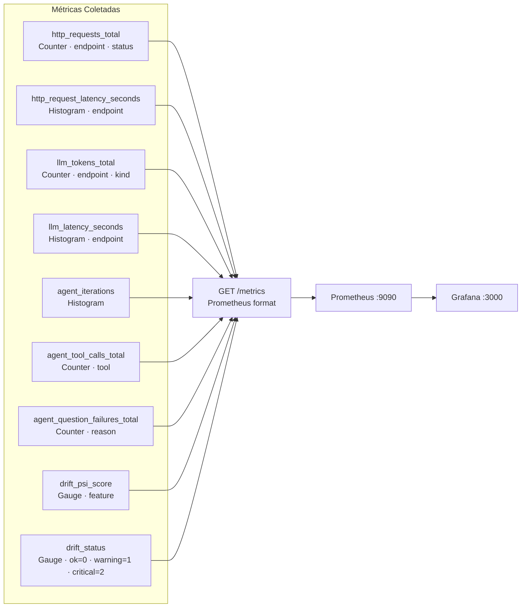
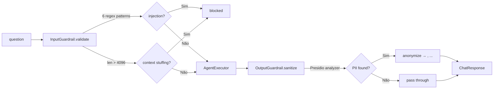
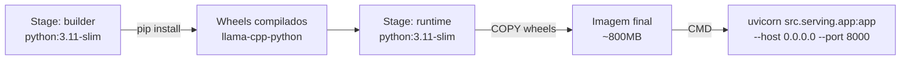

# src/serving/ — FastAPI + LLM Quantizado

API REST que serve o LLM quantizado (GGUF) e o agente ReAct com telemetria Prometheus integrada e guardrails de segurança. Cobre as **Etapas 2, 3 e 4** do Datathon.

---

## Sumário

1. [Visão Geral](#visão-geral)
2. [Endpoints](#endpoints)
3. [Ciclo de Vida de uma Requisição](#ciclo-de-vida-de-uma-requisição)
4. [LLM Quantizado](#llm-quantizado)
5. [Telemetria Prometheus](#telemetria-prometheus)
6. [Segurança Integrada](#segurança-integrada)
7. [Docker](#docker)
8. [Uso](#uso)

---

## Visão Geral

```
src/serving/
├── __init__.py
├── app.py        # FastAPI application + endpoints + middleware
└── Dockerfile    # multi-stage build (builder → runtime)
```

**Porta padrão:** `8000`

---

## Endpoints

| Método | Path | Descrição | Etapa |
|--------|------|-----------|-------|
| `GET` | `/health` | Liveness/readiness check | 2 |
| `GET` | `/metrics` | Prometheus exposition format | 3 |
| `POST` | `/llm/complete` | Completion direta no LLM GGUF | 2 |
| `POST` | `/agent/chat` | Pergunta → guardrail → ReAct → guardrail → resposta | 2/4 |

### `GET /health`

```json
{"status": "ok"}
```

### `POST /llm/complete`

**Request:**
```json
{
  "prompt": "Explique o que é RSI em análise técnica.",
  "max_tokens": 256,
  "temperature": 0.0
}
```

**Response:**
```json
{
  "completion": "RSI (Relative Strength Index) é...",
  "model": "qwen2.5-3b-instruct-q4_k_m.gguf",
  "tokens_used": 128
}
```

### `POST /agent/chat`

**Request:**
```json
{
  "question": "Qual ação teve maior retorno em 2024?"
}
```

**Response:**
```json
{
  "answer": "Em 2024, VALE3.SA teve o maior retorno com 32.10%...",
  "intermediate_steps": 3,
  "guardrail_action": "none"
}
```

**`guardrail_action` possíveis:**

| Valor | Significado |
|-------|-------------|
| `none` | Nenhuma intervenção |
| `blocked` | Input bloqueado pelo `InputGuardrail` |
| `sanitized` | Output sanitizado pelo `OutputGuardrail` (PII removida) |

---

## Ciclo de Vida de uma Requisição



---

## LLM Quantizado

O LLM é carregado **uma única vez** por processo via `lru_cache`, satisfazendo o requisito "LLM servido via API com quantização aplicada".

```mermaid
flowchart LR
    ENV[LLM_MODEL_PATH<br/>env variable] --> LOAD[Llama()]
    CONF[configs/llm_config.yaml<br/>n_ctx · n_threads · n_gpu_layers] --> LOAD
    LOAD -->|lru_cache maxsize=1| INST[Instância LLM<br/>na memória]
    INST --> EP1[POST /llm/complete]
    INST -.->|via OpenAI-compat| EP2[POST /agent/chat]
```

**Parâmetros de quantização (`configs/llm_config.yaml`):**

| Parâmetro | Padrão | Descrição |
|-----------|--------|-----------|
| `model_path` | — | Caminho para arquivo `.gguf` |
| `n_ctx` | 4096 | Janela de contexto em tokens |
| `n_threads` | 4 | Threads de CPU para inferência |
| `n_gpu_layers` | 0 | Camadas offloadas para GPU (0 = CPU-only) |

**Modelo padrão:** `Qwen2.5-3B-Instruct-Q4_K_M.gguf`

- Quantização **Q4\_K\_M** reduz o modelo de ~6GB (FP16) para ~1.8GB
- Mantém qualidade aceitável com redução de 70% no uso de memória

---

## Telemetria Prometheus

O middleware HTTP e os endpoints medem automaticamente todas as requisições.



**Alertas configurados em `configs/prometheus_alerts.yml`:**

| Alerta | Condição | Severidade |
|--------|----------|------------|
| `HighLatency` | p99 > 5s por 5min | warning |
| `DriftCritical` | `drift_status == 2` | critical |
| `LowRAGASScore` | faithfulness < 0.6 | warning |
| `SecurityBlock` | failures > 10/min | warning |

---

## Segurança Integrada



Detalhes completos em [`security/README.md`](../security/README.md).

---

## Docker

### `src/serving/Dockerfile`

Build multi-stage para minimizar tamanho da imagem final:



### Variáveis de Ambiente no Container

```bash
docker run -p 8000:8000 \
  -e LLM_MODEL_PATH=/models/qwen2.5-3b-instruct-q4_k_m.gguf \
  -e MLFLOW_TRACKING_URI=http://mlflow:5000 \
  -e OPENAI_API_BASE=http://llm-server:8001/v1 \
  -v $(pwd)/models:/models \
  mlet-phase5-api
```

---

## Uso

### Desenvolvimento local

```bash
export LLM_MODEL_PATH="models/qwen2.5-3b-instruct-q4_k_m.gguf"
uvicorn src.serving.app:app --reload --port 8000
```

### Via Makefile

```bash
make serve      # inicia a API
make docker-up  # sobe toda a stack (api + mlflow + prometheus + grafana)
```

### Testando os endpoints

```bash
# Health check
curl http://localhost:8000/health

# Completion direta no LLM
curl -X POST http://localhost:8000/llm/complete \
  -H "Content-Type: application/json" \
  -d '{"prompt": "O que é P/L?", "max_tokens": 100}'

# Agente ReAct
curl -X POST http://localhost:8000/agent/chat \
  -H "Content-Type: application/json" \
  -d '{"question": "Compare PETR4 e VALE3 pelo ROE."}'

# Métricas Prometheus
curl http://localhost:8000/metrics
```

### Swagger UI

Acesse `http://localhost:8000/docs` para documentação interativa dos endpoints.
