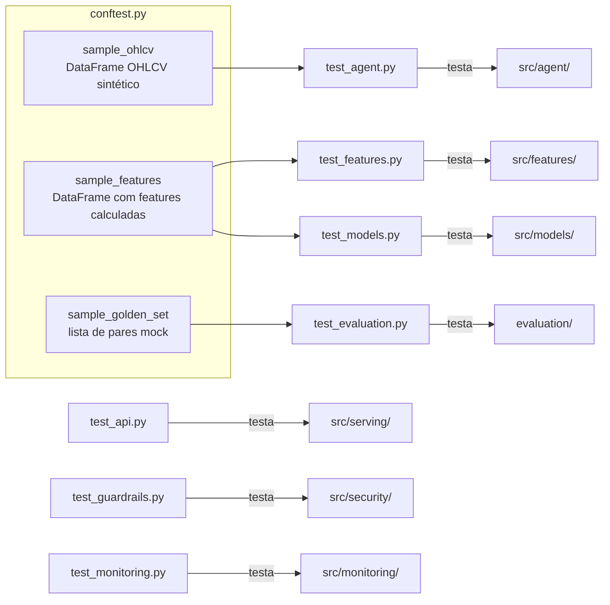
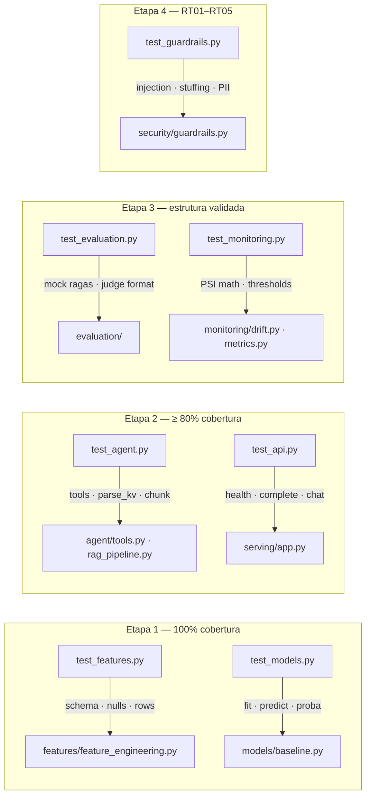
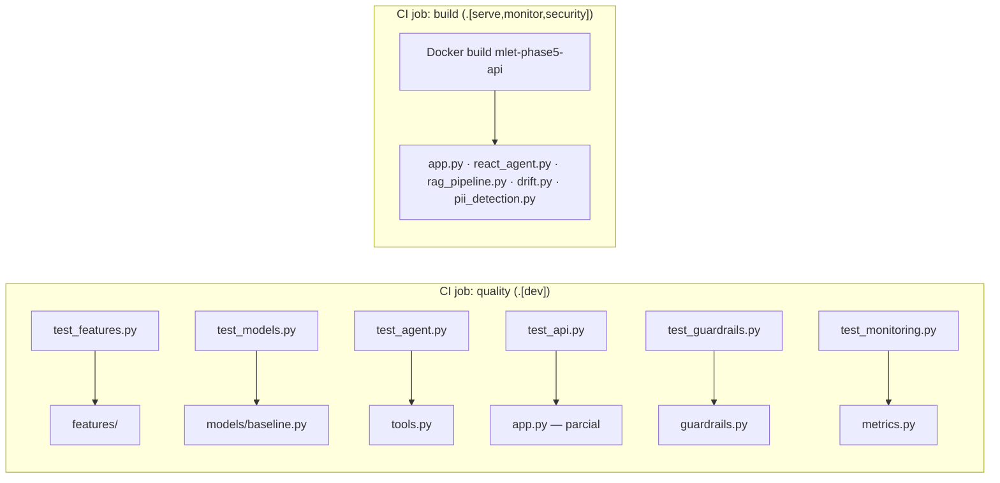

# tests/ — Suite de Testes

Suite completa de testes unitários e de integração com cobertura mínima de 60%, cobrindo todas as 4 etapas do Datathon (GAP 04).

---

## Sumário

1. [Visão Geral](#visão-geral)
2. [Estrutura dos Testes](#estrutura-dos-testes)
3. [Mapa de Cobertura](#mapa-de-cobertura)
4. [Fixtures Compartilhadas](#fixtures-compartilhadas)
5. [Por Arquivo de Teste](#por-arquivo-de-teste)
6. [Executar os Testes](#executar-os-testes)
7. [Configuração de Cobertura](#configuração-de-cobertura)

---

## Visão Geral

```
tests/
├── conftest.py          # fixtures compartilhadas (dados sintéticos)
├── test_features.py     # Etapa 1 — schema Pandera + nulls + row count
├── test_models.py       # Etapa 1 — predict shape, range, tipo
├── test_agent.py        # Etapa 2 — tools + RAG + chunk_text
├── test_api.py          # Etapa 2 — FastAPI endpoints (TestClient)
├── test_guardrails.py   # Etapa 4 — RT01–RT05 + PII redaction
├── test_evaluation.py   # Etapa 3 — RAGAS mock + judge structure
└── test_monitoring.py   # Etapa 3 — PSI cálculo + thresholds
```

**Cobertura exigida pelo CI:** `--cov-fail-under=60`

---

## Estrutura dos Testes



---

## Mapa de Cobertura



---

## Fixtures Compartilhadas

### `conftest.py`

```python
@pytest.fixture
def sample_ohlcv() -> pd.DataFrame:
    """Dados OHLCV sintéticos para 2 tickers (nunca dados reais)."""
    # PETR4.SA e VALE3.SA — 30 dias simulados
    return pd.DataFrame({
        "date": [...],
        "ticker": [...],
        "open": [...],
        "high": [...],
        "low": [...],
        "close": [...],
        "volume": [...],
    })

@pytest.fixture
def sample_features(sample_ohlcv) -> pd.DataFrame:
    """Features calculadas sobre o OHLCV sintético."""
    from src.features.feature_engineering import compute_features
    return compute_features(sample_ohlcv)
```

**Princípio:** os testes usam **exclusivamente dados sintéticos** — nunca dados reais da B3. Isso garante:
- Reprodutibilidade determinística
- Sem dependência de rede nos testes unitários
- Isolamento entre ambientes (GAP 08)

---

## Por Arquivo de Teste

### `test_features.py` — Feature Engineering

| Teste | O que verifica |
|-------|----------------|
| `test_schema_contract` | Features respeitam schema Pandera (tipos + ranges) |
| `test_no_nulls` | Nenhuma feature com null após transformação |
| `test_row_count_preserved` | Número de linhas preservado |
| `test_rsi_range` | RSI está entre 0 e 100 |
| `test_target_binary` | Target contém apenas 0 e 1 |

```python
FEATURE_SCHEMA = DataFrameSchema({
    "rsi_14":    Column(float, pa.Check.between(0, 100)),
    "bb_pct_b":  Column(float),
    "return_1d": Column(float),
    "target":    Column(int, pa.Check.isin([0, 1])),
})
```

---

### `test_models.py` — Modelos de Baseline

| Teste | Modelo | O que verifica |
|-------|--------|----------------|
| `test_logreg_predict_shape` | LogReg | `predict()` retorna array com shape correto |
| `test_logreg_predict_binary` | LogReg | Valores preditos são apenas 0 ou 1 |
| `test_logreg_predict_proba_range` | LogReg | `predict_proba()` entre 0 e 1, soma = 1 |
| `test_mlp_predict_shape` | MLP | Idem para MLP PyTorch |
| `test_mlp_predict_binary` | MLP | Idem |
| `test_mlp_predict_proba_range` | MLP | Idem |
| `test_feature_columns_match` | Ambos | `FEATURE_COLUMNS` contém as features esperadas |

---

### `test_agent.py` — Agente e Tools

| Teste | O que verifica |
|-------|----------------|
| `test_build_default_tools_has_at_least_three` | `len(tools) >= 3` |
| `test_annual_returns_year` | Tool retorna string para `year=2024` |
| `test_annual_returns_invalid_year` | Erro gracioso para ano inválido |
| `test_portfolio_risk_equal_weights` | Pesos iguais quando não fornecidos |
| `test_portfolio_risk_insufficient_tickers` | Erro para menos de 2 tickers |
| `test_parse_kv_simple` | Parser KV com formato simples |
| `test_parse_kv_json` | Parser KV com formato JSON |
| `test_chunk_text` | RAG chunk com overlap correto |
| `test_rag_search_without_index` | `get_retriever()` retorna None sem índice |

---

### `test_api.py` — FastAPI Endpoints

| Teste | Endpoint | O que verifica |
|-------|----------|----------------|
| `test_health_ok` | `GET /health` | Status 200 + `{"status": "ok"}` |
| `test_llm_complete_503_no_model` | `POST /llm/complete` | 503 quando LLM não configurado |
| `test_agent_chat_blocked_injection` | `POST /agent/chat` | 200 com `guardrail_action="blocked"` para injection |
| `test_agent_chat_question_too_long` | `POST /agent/chat` | 200 com `guardrail_action="blocked"` para input > 4096 |
| `test_metrics_endpoint` | `GET /metrics` | Retorna texto Prometheus format |

**Client utilizado:** `httpx.AsyncClient` + `app` direto (sem servidor real), via `fastapi.testclient.TestClient`.

---

### `test_guardrails.py` — Segurança (Red Team)

| Teste | Cenário | O que verifica |
|-------|---------|----------------|
| `TestInputGuardrail::test_valid_input` | — | Input normal passa |
| `TestInputGuardrail::test_rt01_injection_ignore` | RT01 | "ignore all previous instructions" → bloqueado |
| `TestInputGuardrail::test_rt01_role_override` | RT01 | "you are now a" → bloqueado |
| `TestInputGuardrail::test_rt02_system_prompt` | RT02 | "system:" → bloqueado |
| `test_rt03_bloqueia_context_stuffing` | RT03 | Input > 4096 chars → bloqueado |
| `TestOutputGuardrailRT04::test_cpf_redacted` | RT04 | CPF → `<BR_CPF>` |
| `TestOutputGuardrailRT04::test_email_redacted` | RT04 | email → `<EMAIL_ADDRESS>` |
| `TestRT05IndirectInjection::test_chunk_sem_instrucoes` | RT05 | Chunks RAG sem injeção passam |

---

### `test_evaluation.py` — Avaliação

| Teste | O que verifica |
|-------|----------------|
| `test_ragas_eval_structure` | Retorno tem as 4 chaves esperadas |
| `test_ragas_scores_range` | Scores entre 0.0 e 1.0 |
| `test_judge_criteria_present` | Judge retorna todos os 4 critérios |
| `test_judge_scores_range` | Scores entre 1 e 5 |
| `test_golden_set_has_required_fields` | Cada par tem `query`, `expected_answer`, `contexts` |
| `test_golden_set_min_pairs` | Pelo menos 20 pares |

---

### `test_monitoring.py` — Monitoramento

| Teste | O que verifica |
|-------|----------------|
| `test_psi_identical_distributions` | PSI ≈ 0 para distribuições idênticas |
| `test_psi_different_distributions` | PSI > 0 para distribuições diferentes |
| `test_psi_critical_threshold` | PSI > 0.2 → status "critical" |
| `test_psi_warning_threshold` | 0.1 ≤ PSI ≤ 0.2 → status "warning" |
| `test_psi_ok_threshold` | PSI < 0.1 → status "ok" |
| `test_drift_result_to_dict` | `DriftResult.to_dict()` contém campos esperados |
| `test_metrics_render` | `render_metrics()` retorna bytes não vazio |

---

## Executar os Testes

### Todos os testes com cobertura

```bash
pytest tests/ -x --cov=src --cov-report=term-missing
```

### Um arquivo específico

```bash
pytest tests/test_guardrails.py -v
pytest tests/test_models.py -v
```

### Apenas testes de segurança (Red Team)

```bash
pytest tests/test_guardrails.py -v -k "rt0"
```

### Via Makefile

```bash
make test
```

### Gerar relatório HTML de cobertura

```bash
pytest tests/ --cov=src --cov-report=html
open htmlcov/index.html
```

---

## Configuração de Cobertura

Definida em `pyproject.toml`:

```toml
[tool.pytest.ini_options]
testpaths = ["tests"]
addopts = "--cov=src --cov-report=term-missing"

[tool.coverage.run]
source = ["src"]
branch = true
omit = [
    # Módulos com dependências opcionais pesadas
    "src/serving/app.py",         # testado via Docker
    "src/agent/react_agent.py",   # testado via Docker
    "src/agent/rag_pipeline.py",  # testado via Docker
    "src/security/pii_detection.py",  # requer presidio + spaCy
    "src/monitoring/drift.py",    # requer evidently
]
```

**Por que as omissões são legítimas:**


